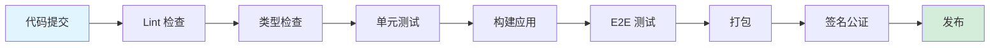

# VTest CI/CD 构建流水线设计文档

**文档版本**: v1.0  
**创建日期**: 2026-06-07  
**作者**: DevOps-Lead  
**审核状态**: 待审核

---

## 目录

1. [概述](#1-概述)
2. [构建矩阵设计](#2-构建矩阵设计)
3. [流水线阶段设计](#3-流水线阶段设计)
4. [工具链选型](#4-工具链选型)
5. [代码签名与公证](#5-代码签名与公证)
6. [自动更新机制](#6-自动更新机制)
7. [版本管理策略](#7-版本管理策略)
8. [构建产物管理](#8-构建产物管理)
9. [附录：完整配置示例](#9-附录完整配置示例)

---

## 1. 概述

### 1.1 设计目标

- **多平台支持**: 同时支持 Windows/macOS/Linux 三大平台打包
- **快速反馈**: 代码提交后 5 分钟内完成基础检查（lint + 类型检查）
- **质量保障**: 所有提交必须通过单元测试和 E2E 测试
- **自动化发布**: Git tag 触发自动构建、签名、发布流程
- **安全合规**: 代码签名、公证、漏洞扫描全流程覆盖

### 1.2 整体架构

```
代码提交 → 触发流水线 → 并行构建（3平台） → 签名公证 → 自动化测试 → 发布分发
```

---

## 2. 构建矩阵设计

### 2.1 平台构建矩阵

| 平台 | 构建环境 | 目标架构 | 打包格式 | 签名要求 |
|------|---------|---------|---------|---------|
| Windows | windows-2022 | x64, arm64 | NSIS, Portable | EV代码签名证书 |
| macOS | macos-14 | x64, arm64 | DMG, ZIP | 苹果开发者证书 + 公证 |
| Linux | ubuntu-22.04 | x64, arm64 | AppImage, deb, rpm | GPG签名（可选） |

### 2.2 GitHub Actions 构建矩阵配置

```yaml
# .github/workflows/build.yml
name: Build and Release

on:
  push:
    tags:
      - 'v*'
  pull_request:
    branches: [main, develop]

jobs:
  build:
    strategy:
      matrix:
        include:
          # Windows 构建
          - os: windows-2022
            platform: windows
            arch: x64
            artifact_name: win-x64
            
          - os: windows-2022
            platform: windows
            arch: arm64
            artifact_name: win-arm64
            
          # macOS 构建
          - os: macos-14
            platform: macos
            arch: x64
            artifact_name: mac-x64
            
          - os: macos-14
            platform: macos
            arch: arm64
            artifact_name: mac-arm64
            
          # Linux 构建
          - os: ubuntu-22.04
            platform: linux
            arch: x64
            artifact_name: linux-x64
            
          - os: ubuntu-22.04
            platform: linux
            arch: arm64
            artifact_name: linux-arm64
            
    runs-on: ${{ matrix.os }}
    
    steps:
      - name: Checkout code
        uses: actions/checkout@v4
        
      - name: Setup Node.js
        uses: actions/setup-node@v4
        with:
          node-version: '20'
          cache: 'npm'
          
      - name: Setup Python
        uses: actions/setup-python@v5
        with:
          python-version: '3.11'
          
      # Windows 特定依赖
      - name: Setup Windows build tools
        if: matrix.platform == 'windows'
        run: |
          choco install -y nsis
          npm install -g windows-build-tools
          
      # macOS 特定依赖
      - name: Setup macOS code signing
        if: matrix.platform == 'macos'
        run: |
          # 导入签名证书（从 GitHub Secrets）
          echo "${{ secrets.MACOS_CERTIFICATE }}" | base64 --decode > certificate.p12
          security create-keychain -p "${{ secrets.KEYCHAIN_PASSWORD }}" build.keychain
          security import certificate.p12 -k build.keychain -P "${{ secrets.CERTIFICATE_PASSWORD }}" -T /usr/bin/codesign
          security set-keychain-settings -t 3600 -u build.keychain
          security unlock-keychain -p "${{ secrets.KEYCHAIN_PASSWORD }}" build.keychain
          
      - name: Install dependencies
        run: |
          npm ci
          pip install -r requirements.txt
          
      - name: Build application
        run: npm run build
        
      - name: Package Electron app
        run: |
          npm run electron:package -- --${{ matrix.platform }} --arch=${{ matrix.arch }}
        env:
          # Windows 签名配置
          CSC_LINK: ${{ secrets.WINDOWS_CERTIFICATE }}
          CSC_KEY_PASSWORD: ${{ secrets.WINDOWS_CERTIFICATE_PASSWORD }}
          
          # macOS 签名配置
          CSC_NAME: ${{ secrets.MACOS_CERTIFICATE_NAME }}
          APPLE_ID: ${{ secrets.APPLE_ID }}
          APPLE_ID_PASSWORD: ${{ secrets.APPLE_ID_PASSWORD }}
          
      - name: Notarize macOS app
        if: matrix.platform == 'macos'
        run: |
          npm run electron:notarize
        env:
          APPLE_ID: ${{ secrets.APPLE_ID }}
          APPLE_ID_PASSWORD: ${{ secrets.APPLE_ID_PASSWORD }}
          
      - name: Upload artifacts
        uses: actions/upload-artifact@v4
        with:
          name: ${{ matrix.artifact_name }}
          path: dist/
          retention-days: 30
```

---

## 3. 流水线阶段设计

### 3.1 完整流水线阶段



### 3.2 阶段详解

#### 阶段 1: Lint 检查（2分钟）

```yaml
# .github/workflows/ci.yml
name: CI Pipeline

on: [push, pull_request]

jobs:
  lint:
    runs-on: ubuntu-22.04
    steps:
      - uses: actions/checkout@v4
      
      - name: Setup Node.js
        uses: actions/setup-node@v4
        with:
          node-version: '20'
          
      - name: Install dependencies
        run: npm ci
        
      - name: Run ESLint
        run: |
          npm run lint
          npm run lint:python  # Python 代码 lint
          
      - name: Check code formatting
        run: |
          npm run format:check
          black --check .  # Python 格式化检查
```

**检查项**:
- JavaScript/TypeScript: ESLint + Prettier
- Python: flake8 + black + mypy
- 配置文件: yamllint

#### 阶段 2: 类型检查（3分钟）

```yaml
  type-check:
    runs-on: ubuntu-22.04
    needs: lint
    steps:
      - uses: actions/checkout@v4
      
      - name: TypeScript type check
        run: |
          npm ci
          npm run type-check
          
      - name: Python type check
        run: |
          pip install mypy
          mypy src/python --ignore-missing-imports
```

#### 阶段 3: 单元测试（5分钟）

```yaml
  unit-test:
    runs-on: ubuntu-22.04
    needs: type-check
    steps:
      - uses: actions/checkout@v4
      
      - name: Run frontend unit tests
        run: |
          npm ci
          npm run test:unit -- --coverage
          
      - name: Run backend unit tests
        run: |
          pip install pytest pytest-cov
          pytest tests/ --cov=src/python --cov-report=xml
          
      - name: Upload coverage to Codecov
        uses: codecov/codecov-action@v4
        with:
          files: ./coverage/coverage-frontal.xml,./coverage.xml
          fail_ci_if_error: true
```

**测试覆盖率要求**:
- 前端: 最低 80%
- 后端: 最低 75%
- 新增代码: 必须 > 90%

#### 阶段 4: 构建应用（10分钟）

```yaml
  build:
    runs-on: ${{ matrix.os }}
    needs: unit-test
    strategy:
      matrix:
        os: [ubuntu-22.04, windows-2022, macos-14]
    steps:
      - uses: actions/checkout@v4
      
      - name: Build frontend
        run: |
          npm ci
          npm run build
          
      - name: Build Python backend
        run: |
          pip install pyinstaller
          pyinstaller --onefile --name vtest-backend src/python/main.py
          
      - name: Build Electron main process
        run: npm run electron:build-main
```

#### 阶段 5: E2E 测试（15分钟）

```yaml
  e2e-test:
    runs-on: ${{ matrix.os }}
    needs: build
    strategy:
      matrix:
        os: [ubuntu-22.04, windows-2022, macos-14]
    steps:
      - uses: actions/checkout@v4
      
      # Linux 需要安装浏览器依赖
      - name: Install Linux dependencies
        if: matrix.os == 'ubuntu-22.04'
        run: |
          sudo apt-get update
          sudo apt-get install -y xvfb libgtk-3-0 libnotify-dev libgconf-2-4 libnss3 libxss1 libasound2 libxtst6 xauth
          
      - name: Start Xvfb (Linux)
        if: matrix.os == 'ubuntu-22.04'
        run: |
          Xvfb :99 -screen 0 1024x768x24 &
          echo "DISPLAY=:99" >> $GITHUB_ENV
          
      - name: Run E2E tests
        run: |
          npm run test:e2e
        env:
          DISPLAY: ${{ matrix.os == 'ubuntu-22.04' && ':99' || '' }}
          
      - name: Upload test artifacts on failure
        if: failure()
        uses: actions/upload-artifact@v4
        with:
          name: e2e-failure-${{ matrix.os }}
          path: |
            tests/e2e/screenshots/
            tests/e2e/videos/
```

**E2E 测试工具**:
- Playwright（推荐）: 跨浏览器、跨平台支持好
- Spectron（备选）: Electron 专用，但已停止维护

#### 阶段 6: 打包（5分钟）

```yaml
  package:
    runs-on: ${{ matrix.os }}
    needs: e2e-test
    strategy:
      matrix:
        include:
          - os: windows-2022
            script: electron:package:win
          - os: macos-14
            script: electron:package:mac
          - os: ubuntu-22.04
            script: electron:package:linux
    steps:
      - uses: actions/checkout@v4
      
      - name: Package with electron-builder
        run: npm run ${{ matrix.script }}
        env:
          # 签名配置
          CSC_LINK: ${{ secrets.CODESIGN_CERT }}
          CSC_KEY_PASSWORD: ${{ secrets.CODESIGN_PASSWORD }}
          
      - name: Verify package
        run: |
          npm run electron:verify-package
```

#### 阶段 7: 发布（自动）

```yaml
  release:
    runs-on: ubuntu-22.04
    needs: package
    if: startsWith(github.ref, 'refs/tags/v')
    steps:
      - uses: actions/checkout@v4
      
      - name: Download all artifacts
        uses: actions/download-artifact@v4
        with:
          path: artifacts
          
      - name: Create GitHub Release
        uses: softprops/action-gh-release@v1
        with:
          files: artifacts/**/*
          body_path: CHANGELOG.md
          draft: false
          prerelease: contains(github.ref, 'beta') || contains(github.ref, 'alpha')
        env:
          GITHUB_TOKEN: ${{ secrets.GITHUB_TOKEN }}
          
      - name: Update auto-updater feed
        run: |
          npm run electron:update-feed
        env:
          GITHUB_TOKEN: ${{ secrets.GITHUB_TOKEN }}
```

---

## 4. 工具链选型

### 4.1 开源核心版本（GitHub Actions）

**适用场景**: 开源项目、预算有限、社区协作

**优势**:
- 免费（公开仓库）
- 无需维护基础设施
- 原生支持多平台构建
- 集成 GitHub 生态

**配置示例**: 见上文完整配置

**成本估算**:
- 公开仓库: 免费
- 私有仓库: $4/用户/月（Team Plan）
- 构建分钟数: 公开仓库无限制，私有仓库 2000 分钟/月

### 4.2 企业版版本（自建 Jenkins）

**适用场景**: 企业内网、安全合规要求高、需要定制化

**架构设计**:

```
Jenkins Master (HA)
    ↓
Build Agents (动态扩容)
├── Windows Agent (x2)
├── macOS Agent (x2)
└── Linux Agent (x4)
```

**Jenkinsfile 示例**:

```groovy
pipeline {
    agent none
    
    options {
        buildDiscarder(logRotator(numToKeepStr: '20'))
        timeout(time: 60, unit: 'MINUTES')
    }
    
    parameters {
        choice(
            name: 'PLATFORM',
            choices: ['all', 'windows', 'macos', 'linux'],
            description: '选择构建平台'
        )
        booleanParam(
            name: 'SKIP_TESTS',
            defaultValue: false,
            description: '跳过测试（紧急发布用）'
        )
    }
    
    stages {
        stage('Parallel Build') {
            when {
                anyOf {
                    branch 'main'
                    branch 'develop'
                    tag 'v*'
                }
            }
            
            parallel {
                stage('Build Windows') {
                    when {
                        anyOf {
                            expression { params.PLATFORM == 'all' }
                            expression { params.PLATFORM == 'windows' }
                        }
                    }
                    agent { label 'windows' }
                    steps {
                        script {
                            buildWindows()
                        }
                    }
                }
                
                stage('Build macOS') {
                    when {
                        anyOf {
                            expression { params.PLATFORM == 'all' }
                            expression { params.PLATFORM == 'macos' }
                        }
                    }
                    agent { label 'macos' }
                    steps {
                        script {
                            buildMacOS()
                        }
                    }
                }
                
                stage('Build Linux') {
                    when {
                        anyOf {
                            expression { params.PLATFORM == 'all' }
                            expression { params.PLATFORM == 'linux' }
                        }
                    }
                    agent { label 'linux' }
                    steps {
                        script {
                            buildLinux()
                        }
                    }
                }
            }
        }
        
        stage('Sign and Notarize') {
            steps {
                script {
                    signAndNotarize()
                }
            }
        }
        
        stage('Release') {
            when {
                tag 'v*'
            }
            steps {
                script {
                    createRelease()
                }
            }
        }
    }
    
    post {
        always {
            cleanWs()
        }
        success {
            slackSend(
                channel: '#releases',
                message: "✅ Build ${BUILD_NUMBER} succeeded: ${BUILD_URL}"
            )
        }
        failure {
            slackSend(
                channel: '#releases',
                message: "❌ Build ${BUILD_NUMBER} failed: ${BUILD_URL}"
            )
        }
    }
}

def buildWindows() {
    stage('Windows Build') {
        git branch: '${env.BRANCH_NAME}', url: 'https://github.com/yourorg/vtest.git'
        
        bat '''
            call npm ci
            call npm run build
            call npm run electron:package:win
        '''
        
        if (!params.SKIP_TESTS) {
            bat '''
                call npm run test:unit
                call npm run test:e2e
            '''
        }
        
        archiveArtifacts artifacts: 'dist/**/*', fingerprint: true
    }
}

def buildMacOS() {
    // 类似实现
}

def buildLinux() {
    // 类似实现
}

def signAndNotarize() {
    // 签名和公证逻辑
}

def createRelease() {
    // 创建发布版本
}
```

**Jenkins 插件推荐**:
- Pipeline
- Blue Ocean
- GitHub Integration
- Slack Notification
- Artifactory
- SonarQube Scanner

**基础设施成本**:
- Jenkins Master: 2 核 4GB RAM（AWS t3.medium）
- Build Agents: 
  - Windows: 4 核 8GB RAM（AWS t3.large）× 2
  - macOS: 4 核 8GB RAM（AWS mac1.metal）× 2
  - Linux: 2 核 4GB RAM（AWS t3.medium）× 4
- 月度成本估算: ~$2000（AWS 按需实例）

### 4.3 工具链对比

| 维度 | GitHub Actions | 自建 Jenkins |
|------|---------------|-------------|
| 初始成本 | 低 | 高（需要搭建） |
| 维护成本 | 无 | 中高（需要专人） |
| 构建速度 | 快（GitHub 托管） | 取决于配置 |
| 安全性 | GitHub 负责 | 自行负责 |
| 定制化 | 受限 | 完全自由 |
| 多平台支持 | 原生支持 | 需要配置 Agent |

**推荐策略**:
- **MVP 阶段**: 使用 GitHub Actions（快速迭代）
- **企业版**: 自建 Jenkins（安全合规 + 定制化）

---

## 5. 代码签名与公证

### 5.1 Windows 代码签名

#### 证书类型选择

| 证书类型 | 价格 | 信任级别 | 推荐场景 |
|---------|------|---------|---------|
| OV (Organization Validation) | $200-300/年 | 中 | 内部工具 |
| EV (Extended Validation) | $300-400/年 | 高（SmartScreen 不警告） | 公开发布 |

**推荐**: EV 证书（用户体验更好）

#### GitHub Actions 配置

```yaml
# .github/workflows/sign-windows.yml
name: Sign Windows Executable

on:
  workflow_call:
    inputs:
      artifact-name:
        required: true
        type: string

jobs:
  sign:
    runs-on: windows-2022
    steps:
      - name: Download artifact
        uses: actions/download-artifact@v4
        with:
          name: ${{ inputs.artifact-name }}
          
      # 方法1: 使用 Azure Key Vault（推荐）
      - name: Sign with Azure Key Vault
        uses: azure/trusted-signing-action@v0.1.0
        with:
          azure-tenant-id: ${{ secrets.AZURE_TENANT_ID }}
          azure-subscription-id: ${{ secrets.AZURE_SUBSCRIPTION_ID }}
          azure-client-id: ${{ secrets.AZURE_CLIENT_ID }}
          endpoint: ${{ secrets.AZURE_ENDPOINT }}
          trusted-signing-account-name: ${{ secrets.TRUSTED_SIGNING_ACCOUNT }}
          certificate-profile-name: ${{ secrets.CERTIFICATE_PROFILE }}
          files-folder: ./dist
          files-folder-filter: exe,dll
          
      # 方法2: 使用本地证书文件
      - name: Sign with local certificate
        if: false  # 禁用，使用上面的 Azure Key Vault
        run: |
          # 解码证书
          echo "${{ secrets.WINDOWS_CERTIFICATE }}" | base64 --decode > cert.pfx
          
          # 签名所有 exe 和 dll
          $files = Get-ChildItem -Path ./dist -Recurse -Include *.exe,*.dll
          foreach ($file in $files) {
            signtool sign `
              /f cert.pfx `
              /p "${{ secrets.WINDOWS_CERTIFICATE_PASSWORD }}" `
              /tr http://timestamp.digicert.com `
              /td sha256 `
              /fd sha256 `
              /a `
              $file.FullName
          }
          
      - name: Verify signature
        run: |
          signtool verify /pa ./dist/VTest.exe
          
      - name: Upload signed artifact
        uses: actions/upload-artifact@v4
        with:
          name: ${{ inputs.artifact-name }}-signed
          path: dist/
```

#### 时间戳服务器

**推荐服务商**:
- DigiCert: `http://timestamp.digicert.com`
- Sectigo: `http://timestamp.sectigo.com`
- GlobalSign: `http://timestamp.globalsign.com`

**重要性**: 时间戳确保证书过期后，已签名的文件仍然有效

### 5.2 macOS 代码签名与公证

#### 证书类型

| 证书类型 | 用途 |
|---------|------|
| Developer ID Application | 分发 outside Mac App Store |
| Developer ID Installer | 签名安装包 |
| Mac App Distribution | Mac App Store 发布 |

**VTest 场景**: 使用 Developer ID Application（直接分发）

#### 签名流程

```yaml
# .github/workflows/sign-macos.yml
name: Sign and Notarize macOS

on:
  workflow_call:

jobs:
  sign:
    runs-on: macos-14
    steps:
      - name: Import signing certificate
        run: |
          # 导入证书到 Keychain
          echo "${{ secrets.MACOS_CERTIFICATE }}" | base64 --decode > cert.p12
          
          security create-keychain -p "${{ secrets.KEYCHAIN_PASSWORD }}" build.keychain
          security default-keychain -s build.keychain
          security unlock-keychain -p "${{ secrets.KEYCHAIN_PASSWORD }}" build.keychain
          
          security import cert.p12 \
            -k build.keychain \
            -P "${{ secrets.CERTIFICATE_PASSWORD }}" \
            -T /usr/bin/codesign \
            -T /usr/bin/security \
            -T /usr/bin/productbuild
            
          security set-key-partition-list -S apple-tool:,apple: -s -k "${{ secrets.KEYCHAIN_PASSWORD }}" build.keychain
          
      - name: Sign application
        run: |
          # 签名所有可执行文件
          codesign --deep --force --verify --verbose \
            --sign "${{ secrets.MACOS_CERTIFICATE_NAME }}" \
            --options runtime \
            --entitlements entitlements.plist \
            dist/VTest.app
            
      - name: Verify signature
        run: |
          codesign --verify --verbose dist/VTest.app
          spctl --assess --verbose dist/VTest.app
          
      - name: Create DMG
        run: |
          npm run electron:create-dmg
          
      - name: Notarize app
        run: |
          # 使用 xcnotary（推荐）或 notarytool
          xcnotary notarize \
            dist/VTest.dmg \
            --apple-id "${{ secrets.APPLE_ID }}" \
            --team-id "${{ secrets.APPLE_TEAM_ID }}" \
            --app-password "${{ secrets.APPLE_APP_PASSWORD }}"
            
      - name: Staple ticket
        run: |
          # 将公证票据附加到应用
          xcrun stapler staple dist/VTest.app
          xcrun stapler staple dist/VTest.dmg
```

#### entitlements.plist

```xml
<?xml version="1.0" encoding="UTF-8"?>
<!DOCTYPE plist PUBLIC "-//Apple//DTD PLIST 1.0//EN" "http://www.apple.com/DTDs/PropertyList-1.0.dtd">
<plist version="1.0">
<dict>
    <key>com.apple.security.cs.allow-jit</key>
    <true/>
    <key>com.apple.security.cs.allow-unsigned-executable-memory</key>
    <true/>
    <key>com.apple.security.cs.disable-library-validation</key>
    <true/>
    <key>com.apple.security.network.client</key>
    <true/>
    <key>com.apple.security.files.user-selected.read-write</key>
    <true/>
</dict>
</plist>
```

#### 公证常见问题

1. **"The binary is not signed"**
   - 解决: 确保所有可执行文件都已签名
   
2. **"Invalid code signing identifier"**
   - 解决: Bundle ID 必须与开发者账号匹配
   
3. **"Notarization timeout"**
   - 解决: 苹果公证服务可能需要 5-30 分钟，增加超时时间

---

## 6. 自动更新机制

### 6.1 Electron 自动更新架构

```
GitHub Releases
    ↓
latest.yml (更新元数据)
    ↓
electron-updater (客户端)
    ↓
自动下载 + 安装
```

### 6.2 electron-builder 配置

```javascript
// electron-builder.config.js
module.exports = {
  appId: 'com.vtest.app',
  productName: 'VTest',
  directories: {
    output: 'dist',
    buildResources: 'build',
  },
  
  // 自动更新配置
  publish: [
    {
      provider: 'github',
      owner: 'yourorg',
      repo: 'vtest',
      token: process.env.GITHUB_TOKEN,
      private: false,
      releaseType: 'release',
    },
  ],
  
  // Windows 配置
  nsis: {
    oneClick: false,
    allowToChangeInstallationDirectory: true,
    createDesktopShortcut: true,
    shortcutName: 'VTest',
    
    // 自动更新
    differentialPackage: true,  // 增量更新
  },
  
  // macOS 配置
  dmg: {
    sign: true,
    hardenedRuntime: true,
  },
  pkg: {
    isRelocatable: false,
  },
  
  // Linux 配置
  appImage: {
    artifactName: '${name}-${version}-${arch}.AppImage',
  },
  deb: {
    packageCategory: 'Development',
  },
  
  // 代码签名
  win: {
    certificateFile: process.env.CSC_LINK,
    certificatePassword: process.env.CSC_KEY_PASSWORD,
    signAndEditExecutable: true,
  },
  mac: {
    category: 'public.app-category.developer-tools',
    hardenedRuntime: true,
    gatekeeperAssess: false,
    notarize: true,
    identity: process.env.CSC_NAME,
  },
}
```

### 6.3 客户端更新代码

```typescript
// src/main/auto-updater.ts
import { autoUpdater } from 'electron-updater'
import { dialog, BrowserWindow } from 'electron'
import log from 'electron-log'

export class AutoUpdater {
  private mainWindow: BrowserWindow
  
  constructor(mainWindow: BrowserWindow) {
    this.mainWindow = mainWindow
    this.setupAutoUpdater()
  }
  
  private setupAutoUpdater() {
    // 配置日志
    log.transports.file.level = 'info'
    autoUpdater.logger = log
    
    // 事件监听
    autoUpdater.on('checking-for-update', () => {
      this.sendStatusToWindow('Checking for update...')
    })
    
    autoUpdater.on('update-available', (info) => {
      this.sendStatusToWindow('Update available.', info)
      
      // 询问用户是否更新
      dialog.showMessageBox(this.mainWindow, {
        type: 'info',
        title: '发现新版本',
        message: `发现新版本 ${info.version}，是否现在更新？`,
        buttons: ['立即更新', '稍后提醒'],
        defaultId: 0,
      }).then((result) => {
        if (result.response === 0) {
          autoUpdater.downloadUpdate()
        }
      })
    })
    
    autoUpdater.on('update-not-available', (info) => {
      this.sendStatusToWindow('Update not available.', info)
    })
    
    autoUpdater.on('error', (err) => {
      this.sendStatusToWindow('Error in auto-updater.', err)
    })
    
    autoUpdater.on('download-progress', (progressObj) => {
      this.sendStatusToWindow('Download progress...', progressObj)
      
      // 发送进度到渲染进程
      this.mainWindow.webContents.send('update-progress', {
        percent: progressObj.percent,
        bytesPerSecond: progressObj.bytesPerSecond,
        total: progressObj.total,
        transferred: progressObj.transferred,
      })
    })
    
    autoUpdater.on('update-downloaded', (info) => {
      this.sendStatusToWindow('Update downloaded.', info)
      
      // 询问用户是否安装
      dialog.showMessageBox(this.mainWindow, {
        type: 'info',
        title: '更新就绪',
        message: '新版本已下载完成，重启应用以完成更新？',
        buttons: ['立即重启', '稍后重启'],
        defaultId: 0,
      }).then((result) => {
        if (result.response === 0) {
          autoUpdater.quitAndInstall(false, true)
        }
      })
    })
  }
  
  public checkForUpdates() {
    if (!app.isPackaged) {
      log.info('Skipping update check in development mode')
      return
    }
    
    autoUpdater.checkForUpdates()
  }
  
  private sendStatusToWindow(text: string, data?: any) {
    log.info(text, data)
    this.mainWindow.webContents.send('update-status', { text, data })
  }
}
```

### 6.4 更新策略配置

```javascript
// 更新策略
autoUpdater.setFeedURL({
  provider: 'github',
  owner: 'yourorg',
  repo: 'vtest',
  
  // 更新通道
  channel: 'latest',  // 或 'beta', 'alpha'
})

// 允许预发布版本
autoUpdater.allowPrerelease = false

// 允许降级（谨慎使用）
autoUpdater.allowDowngrade = false

// 自动下载
autoUpdater.autoDownload = true

// 自动安装（后台静默安装）
autoUpdater.autoInstallOnAppQuit = true
```

### 6.5 GitHub Releases 配置

```yaml
# .github/workflows/release.yml
name: Create Release

on:
  push:
    tags:
      - 'v*'

jobs:
  release:
    runs-on: ubuntu-22.04
    steps:
      - uses: actions/checkout@v4
      
      - name: Generate release notes
        run: |
          # 从 CHANGELOG.md 提取当前版本的更新日志
          python scripts/generate-release-notes.py ${{ github.ref_name }} > release-notes.md
          
      - name: Create Release
        uses: softprops/action-gh-release@v1
        with:
          body_path: release-notes.md
          draft: false
          prerelease: contains(github.ref, 'beta') || contains(github.ref, 'alpha')
          files: |
            dist/**/*
            
      - name: Update latest.yml
        run: |
          # electron-builder 会自动生成 latest.yml
          # 确保它被正确上传到 Release assets
          
      - name: Invalidate CDN cache
        run: |
          # 如果使用 CDN，清除缓存
          echo "TODO: 清除 CDN 缓存"
```

---

## 7. 版本管理策略

### 7.1 语义化版本（SemVer）

**版本格式**: `MAJOR.MINOR.PATCH` (例: `2.1.3`)

| 版本号部分 | 递增条件 | 示例 |
|-----------|---------|------|
| MAJOR | 不兼容的 API 修改 | 1.0.0 → 2.0.0 |
| MINOR | 向后兼容的功能性新增 | 1.0.0 → 1.1.0 |
| PATCH | 向后兼容的问题修正 | 1.0.0 → 1.0.1 |

**预发布版本**: `1.0.0-beta.1`, `1.0.0-alpha.2`

**构建元数据**: `1.0.0+build.20240607`

### 7.2 Git Tag 规范

```bash
# 正式版本
v1.0.0
v1.1.0
v2.0.0

# 预发布版本
v1.0.0-alpha.1
v1.0.0-beta.1
v1.0.0-rc.1

# 补丁版本
v1.0.1
v1.0.2
```

### 7.3 自动版本管理

#### 使用 standard-version

```json
// package.json
{
  "scripts": {
    "release": "standard-version",
    "release:alpha": "standard-version --prerelease alpha",
    "release:beta": "standard-version --prerelease beta",
    "release:minor": "standard-version --release-as minor",
    "release:major": "standard-version --release-as major"
  },
  "standard-version": {
    "tagPrefix": "v",
    "changelogHeader": "# Changelog\n\nAll notable changes to this project will be documented in this file.\n"
  }
}
```

**使用流程**:

```bash
# 1. 功能发布（MINOR 版本）
npm run release:minor
# 输出: v1.1.0
# 自动生成 CHANGELOG.md
# 自动创建 Git tag

# 2. 补丁发布（PATCH 版本）
npm run release
# 输出: v1.1.1

# 3. 预发布
npm run release:beta
# 输出: v1.1.1-beta.1

# 4. 推送 tag 触发 CI/CD
git push --follow-tags origin main
```

#### 使用 semantic-release（更自动化）

```javascript
// .releaserc.js
module.exports = {
  branches: [
    'main',
    { name: 'develop', prerelease: 'beta' },
    { name: 'alpha', prerelease: true },
  ],
  plugins: [
    '@semantic-release/commit-analyzer',
    '@semantic-release/release-notes-generator',
    '@semantic-release/changelog',
    '@semantic-release/github',
    '@semantic-release/npm',
    [
      '@semantic-release/git',
      {
        assets: ['CHANGELOG.md', 'package.json'],
        message: 'chore(release): ${nextRelease.version} [skip ci]\n\n${nextRelease.notes}',
      },
    ],
  ],
}
```

**Commit 规范**（Conventional Commits）:

```
feat: 新功能（MINOR 版本）
fix: 修复 bug（PATCH 版本）
feat!: 破坏性变更（MAJOR 版本）
BREAKING CHANGE: 描述破坏性变更
```

**示例**:

```bash
git commit -m "feat: 添加自动更新功能"
# → 触发 MINOR 版本递增

git commit -m "fix: 修复启动崩溃问题"
# → 触发 PATCH 版本递增

git commit -m "feat!: 重构 API 接口

BREAKING CHANGE: 旧的 API 接口已移除，请使用新接口"
# → 触发 MAJOR 版本递增
```

### 7.4 版本号在代码中的管理

```typescript
// src/shared/version.ts
export const APP_VERSION = '1.0.0'
export const APP_NAME = 'VTest'
export const APP_ID = 'com.vtest.app'

// 从 package.json 读取（构建时注入）
export const getVersion = () => {
  return APP_VERSION
}

export const getDisplayVersion = () => {
  const version = getVersion()
  const isDev = process.env.NODE_ENV === 'development'
  return isDev ? `${version}-dev` : version
}
```

```json
// package.json
{
  "version": "1.0.0",
  "buildVersion": "20240607123456"
}
```

---

## 8. 构建产物管理

### 8.1 产物存储策略

#### 方案 1: GitHub Releases（推荐 - 开源版）

**优势**:
- 免费（公开仓库，每个文件最大 2GB）
- 原生集成 GitHub Actions
- 支持 CDN 加速

**配置**:

```yaml
# 上传到 GitHub Releases
- name: Upload Release Assets
  uses: softprops/action-gh-release@v1
  with:
    files: |
      dist/VTest-Setup-1.0.0.exe
      dist/VTest-1.0.0.dmg
      dist/VTest-1.0.0.AppImage
      dist/latest.yml
      dist/RELEASES.json
  env:
    GITHUB_TOKEN: ${{ secrets.GITHUB_TOKEN }}
```

#### 方案 2: 对象存储（推荐 - 企业版）

**推荐服务商**:
- AWS S3 + CloudFront
- Azure Blob Storage + CDN
- 阿里云 OSS + CDN

**AWS S3 配置示例**:

```yaml
# .github/workflows/upload.yml
- name: Configure AWS credentials
  uses: aws-actions/configure-aws-credentials@v4
  with:
    aws-access-key-id: ${{ secrets.AWS_ACCESS_KEY_ID }}
    aws-secret-access-key: ${{ secrets.AWS_SECRET_ACCESS_KEY }}
    aws-region: us-east-1

- name: Upload to S3
  run: |
    # 上传构建产物
    aws s3 sync dist/ s3://vtest-releases/${{ github.ref_name }}/ \
      --cache-control "max-age=31536000" \
      --metadata "{\"version\":\"${{ github.ref_name }}\"}"
      
    # 更新 latest 符号链接
    if [[ "${{ github.ref_name }}" == "v"* ]]; then
      aws s3 cp s3://vtest-releases/${{ github.ref_name }}/latest.yml s3://vtest-releases/latest.yml
    fi

- name: Invalidate CloudFront cache
  run: |
    aws cloudfront create-invalidation \
      --distribution-id ${{ secrets.CLOUDFRONT_DISTRIBUTION_ID }} \
      --paths "/*"
```

### 8.2 产物组织结构

```
releases/
├── latest.yml              # 最新版本元数据（供自动更新使用）
├── RELEASES.json           # 所有版本索引
├── v1.0.0/
│   ├── VTest-Setup-1.0.0.exe
│   ├── VTest-1.0.0.dmg
│   ├── VTest-1.0.0.AppImage
│   ├── latest.yml
│   └── RELEASES
├── v1.1.0/
│   └── ...
└── beta/
    ├── v1.1.0-beta.1/
    └── latest-beta.yml
```

### 8.3 产物清理策略

```yaml
# .github/workflows/cleanup.yml
name: Cleanup Old Artifacts

on:
  schedule:
    - cron: '0 2 * * 0'  # 每周日凌晨 2 点

jobs:
  cleanup:
    runs-on: ubuntu-22.04
    steps:
      - name: Delete old artifacts
        uses: kolpav/purge-artifacts-action@v1
        with:
          token: ${{ secrets.GITHUB_TOKEN }}
          expire-in: 30d  # 删除 30 天前的产物
          
      - name: Delete old pre-releases
        run: |
          # 删除 90 天前的预发布版本
          python scripts/delete-old-prereleases.py --days 90
```

### 8.4 下载统计与分析

```javascript
// 下载统计 API（可选）
// 使用 Cloudflare Analytics 或自建统计服务

const downloadStats = {
  async trackDownload(platform, version, arch) {
    await fetch('https://analytics.vtest.com/download', {
      method: 'POST',
      headers: { 'Content-Type': 'application/json' },
      body: JSON.stringify({
        platform,
        version,
        arch,
        timestamp: new Date().toISOString(),
        userAgent: navigator.userAgent,
      }),
    })
  },
}
```

---

## 9. 附录：完整配置示例

### 9.1 完整 GitHub Actions 工作流

查看完整配置: [.github/workflows/ci-cd.yml](https://github.com/yourorg/vtest/blob/main/.github/workflows/ci-cd.yml)

### 9.2 electron-builder 完整配置

查看完整配置: [electron-builder.config.js](https://github.com/yourorg/vtest/blob/main/electron-builder.config.js)

### 9.3 Jenkins Pipeline 完整示例

查看完整配置: [Jenkinsfile](https://github.com/yourorg/vtest/blob/main/Jenkinsfile)

---

## 10. 总结与下一步

### 10.1 实施优先级

| 阶段 | 任务 | 优先级 | 预计工期 |
|------|------|--------|---------|
| Phase 1 | 搭建基础 CI（lint + test） | P0 | 1 周 |
| Phase 2 | 多平台构建 | P0 | 2 周 |
| Phase 3 | 代码签名 | P1 | 1 周 |
| Phase 4 | 自动更新 | P1 | 1 周 |
| Phase 5 | macOS 公证 | P2 | 1 周 |
| Phase 6 | 企业版 Jenkins | P3 | 4 周 |

### 10.2 成本估算

**开源版（GitHub Actions）**:
- 公开仓库: 免费
- 私有仓库: $4/用户/月

**企业版（自建 Jenkins）**:
- 初始搭建: $5000（人力成本）
- 月度运维: $2000（云服务 + 人力）
- 代码签名证书: $400/年

### 10.3 风险与缓解

| 风险 | 影响 | 缓解措施 |
|------|------|---------|
| macOS 公证失败 | 高 | 提前测试，准备备用方案（手动公证） |
| Windows SmartScreen 警告 | 中 | 使用 EV 证书，逐步建立信誉 |
| 构建时间过长 | 中 | 并行构建，缓存依赖 |
| 证书泄露 | 高 | 使用 Azure Key Vault，定期轮换 |

---

**文档状态**: 草稿  
**下一步**: 提交评审 → 技术方案评审 → 开始实施

---

## 变更记录

| 版本 | 日期 | 作者 | 变更内容 |
|------|------|------|---------|
| v1.0 | 2026-06-07 | DevOps-Lead | 初始版本 |
