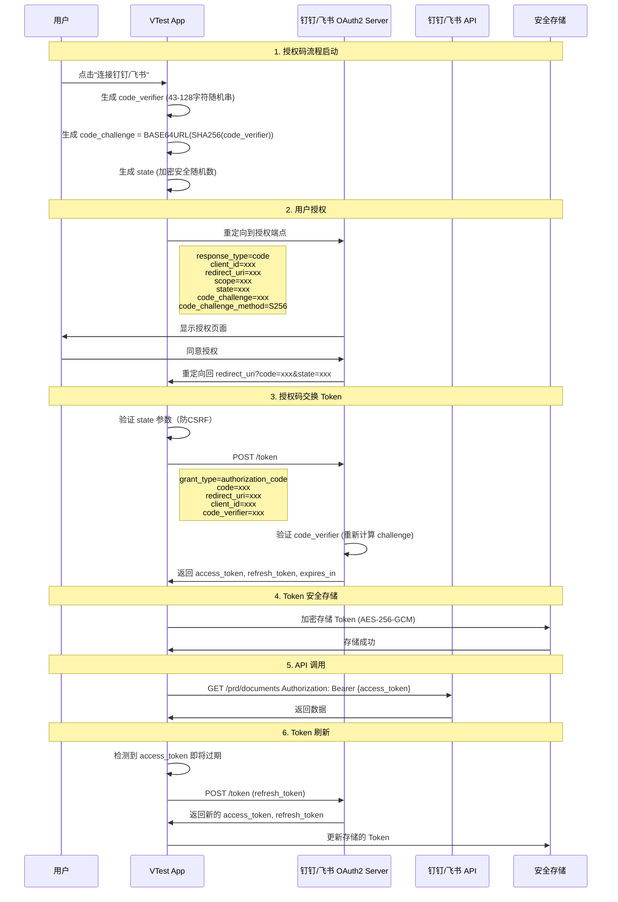

# VTest 安全架构设计文档

**版本**: v1.0  
**日期**: 2026-06-07  
**作者**: Sec-Lead  
**审核**: 待定  
**分类**: 机密 - 内部使用

---

## 目录

1. [概述](#1-概述)
2. [OAuth2 安全架构设计](#2-oauth2-安全架构设计)
3. [Figma Token 管理](#3-figma-token-管理)
4. [内嵌浏览器安全边界](#4-内嵌浏览器安全边界)
5. [APK沙箱隔离方案](#5-apk沙箱隔离方案)
6. [安全审计日志](#6-安全审计日志)
7. [Electron 安全加固清单](#7-electron-安全加固清单)
8. [STRIDE 威胁模型](#8-stride-威胁模型)
9. [安全实施路线图](#9-安全实施路线图)
10. [附录](#10-附录)

---

## 1. 概述

### 1.1 项目背景

VTest 是一款基于 Electron 的桌面应用，核心功能包括：

- **需求管理**: 通过 OAuth2 接入钉钉、飞书，获取 PRD 文档
- **设计稿管理**: 通过 Personal Access Token 接入 Figma，获取设计稿
- **网页内容抓取**: 内嵌浏览器让用户登录已授权网页并抓取内容
- **APK 测试**: 在 AVD 模拟器中运行用户提供的 APK 文件

### 1.2 安全目标

- **机密性**: 保护用户凭证、Token、敏感数据不被泄露
- **完整性**: 防止数据篡改和代码注入
- **可用性**: 确保核心功能在受攻击时仍能安全运行
- **可审计性**: 记录所有安全相关事件，支持事后追溯

### 1.3 安全原则

- **零信任架构**: 不信任任何外部输入，包括用户提供的 APK
- **最小权限原则**: 每个组件只拥有完成其功能所需的最小权限
- **深度防御**: 多层安全防护，单点失效不影响整体安全
- **安全默认配置**: 默认拒绝，显式允许

---

## 2. OAuth2 安全架构设计

### 2.1 钉钉/飞书 Authorization Code Flow + PKCE

#### 2.1.1 完整时序图



#### 2.1.2 PKCE 实现细节

**code_verifier 生成** (Electron 主进程):

```javascript
// src/main/security/oauth-pkce.js
const crypto = require('crypto');

/**
 * 生成 PKCE code_verifier
 * 必须符合 RFC 7636: 43-128 字符，包含 [A-Z] / [a-z] / [0-9] / "-" / "." / "_" / "~"
 */
function generateCodeVerifier() {
    // 生成 32 字节随机数据 (对应 43 字符的 base64url)
    const randomBytes = crypto.randomBytes(32);
    
    // 转换为 base64url 编码 (RFC 7636 Section 4.1)
    const codeVerifier = base64urlEncode(randomBytes);
    
    // 验证长度 (43-128 字符)
    if (codeVerifier.length < 43 || codeVerifier.length > 128) {
        throw new Error('Invalid code_verifier length');
    }
    
    return codeVerifier;
}

/**
 * 从 code_verifier 生成 code_challenge
 * 使用 S256 方法: BASE64URL(SHA256(code_verifier))
 */
function generateCodeChallenge(codeVerifier) {
    const hash = crypto.createHash('sha256');
    hash.update(codeVerifier);
    const codeChallenge = base64urlEncode(hash.digest());
    return codeChallenge;
}

/**
 * Base64URL 编码 (RFC 4648 Section 5)
 * 替换 + 为 -，/ 为 _，移除 =
 */
function base64urlEncode(buffer) {
    return buffer.toString('base64')
        .replace(/\+/g, '-')
        .replace(/\//g, '_')
        .replace(/=/g, '');
}

module.exports = {
    generateCodeVerifier,
    generateCodeChallenge
};
```

**安全注意事项**:

1. **code_verifier 必须每次重新生成**，不能复用
2. **code_verifier 必须安全存储**直到 Token 交换完成 (存储在内存中，使用后立即清除)
3. **禁止使用 plain 方法**，必须使用 S256

#### 2.1.3 State 参数防 CSRF

**State 生成与验证**:

```javascript
// src/main/security/oauth-state.js
const crypto = require('crypto');

/**
 * 生成 state 参数 (防 CSRF)
 * 包含: 随机数 + 时间戳 + 会话 ID
 */
function generateState(sessionId) {
    const random = crypto.randomBytes(16).toString('hex');
    const timestamp = Date.now();
    const data = `${random}:${timestamp}:${sessionId}`;
    
    // 使用 HMAC 签名防止篡改
    const hmac = crypto.createHmac('sha256', process.env.OAUTH_STATE_SECRET);
    hmac.update(data);
    const signature = hmac.digest('hex');
    
    // 组合: data.signature
    const state = Buffer.from(`${data}.${signature}`).toString('base64url');
    
    // 存储到会话 (用于后续验证)
    storeStateInSession(sessionId, state);
    
    return state;
}

/**
 * 验证 state 参数
 */
function validateState(state, sessionId) {
    try {
        // Base64URL 解码
        const decoded = Buffer.from(state, 'base64url').toString();
        const [random, timestamp, stateSessionId, signature] = decoded.split('.');
        
        // 验证会话 ID 匹配
        if (stateSessionId !== sessionId) {
            throw new Error('Session ID mismatch');
        }
        
        // 验证时间戳 (防止重放攻击，5分钟有效期)
        const now = Date.now();
        if (now - parseInt(timestamp) > 5 * 60 * 1000) {
            throw new Error('State parameter expired');
        }
        
        // 验证签名
        const data = `${random}:${timestamp}:${stateSessionId}`;
        const expectedSignature = crypto
            .createHmac('sha256', process.env.OAUTH_STATE_SECRET)
            .update(data)
            .digest('hex');
        
        if (signature !== expectedSignature) {
            throw new Error('Invalid state signature');
        }
        
        // 验证 state 未被使用过 (防止重放)
        if (isStateUsed(state)) {
            throw new Error('State already used (replay attack)');
        }
        
        // 标记 state 已使用
        markStateAsUsed(state);
        
        return true;
    } catch (error) {
        logSecurityEvent('OAUTH_STATE_VALIDATION_FAILED', {
            error: error.message,
            sessionId,
            state: state.substring(0, 20) + '...' // 只记录前20字符
        });
        return false;
    }
}

module.exports = {
    generateState,
    validateState
};
```

#### 2.1.4 Redirect URI 白名单验证

**严格验证 Redirect URI**:

```javascript
// src/main/security/oauth-redirect.js
const allowedRedirectUris = [
    'vtest://oauth/callback/dingtalk',
    'vtest://oauth/callback/feishu',
    'http://localhost:3000/oauth/callback/dingtalk',  // 开发环境
    'http://localhost:3000/oauth/callback/feishu'     // 开发环境
];

/**
 * 验证 redirect_uri 是否在白名单中
 * 必须精确匹配 (防止 open redirect 攻击)
 */
function validateRedirectUri(redirectUri) {
    // 精确匹配 (不允许子路径、参数等)
    if (!allowedRedirectUris.includes(redirectUri)) {
        logSecurityEvent('OAUTH_REDIRECT_URI_REJECTED', {
            redirectUri,
            allowedUris: allowedRedirectUris
        });
        throw new Error('Redirect URI not in whitelist');
    }
    
    // 额外检查: 确保不是 localhost 之外的开发环境
    if (redirectUri.includes('localhost') && process.env.NODE_ENV === 'production') {
        throw new Error('Localhost redirect URI not allowed in production');
    }
    
    return true;
}

/**
 * 解析 redirect_uri (防止 URL 解析绕过)
 */
function parseRedirectUri(redirectUri) {
    let url;
    try {
        url = new URL(redirectUri);
    } catch (error) {
        throw new Error('Invalid redirect URI format');
    }
    
    // 禁止的协议
    const forbiddenProtocols = ['javascript', 'data', 'file'];
    if (forbiddenProtocols.includes(url.protocol.replace(':', ''))) {
        throw new Error(`Forbidden protocol: ${url.protocol}`);
    }
    
    // 必须的标准端口 (防止 DNS rebinding 攻击)
    if (url.hostname === 'localhost') {
        const allowedPorts = ['3000', '8080'];
        if (!allowedPorts.includes(url.port)) {
            throw new Error(`Invalid localhost port: ${url.port}`);
        }
    }
    
    return url;
}

module.exports = {
    validateRedirectUri,
    parseRedirectUri
};
```

### 2.2 Token 加密存储方案

#### 2.2.1 存储架构

```
┌─────────────────────────────────────────────────────────────┐
│                   VTest Electron App                        │
├─────────────────────────────────────────────────────────────┤
│                                                             │
│  ┌─────────────────────┐      ┌─────────────────────┐     │
│  │  主进程 (Main)      │      │  渲染进程 (Renderer)│     │
│  │                     │      │                     │     │
│  │  ┌───────────────┐  │      │  (沙箱隔离)        │     │
│  │  │ Token 管理器  │  │      │  不允许访问 Token  │     │
│  │  └───────────────┘  │      └─────────────────────┘     │
│  │          │          │                                   │
│  │          ▼          │                                   │
│  │  ┌───────────────┐  │                                   │
│  │  │ 加密存储层    │  │                                   │
│  │  └───────────────┘  │                                   │
│  │          │          │                                   │
│  └──────────┼──────────┘                                   │
│             │                                              │
│             ▼                                              │
│  ┌──────────────────────────────────────────────┐         │
│  │        操作系统级安全存储                     │         │
│  │                                              │         │
│  │  ┌────────────┐  ┌────────────┐            │         │
│  │  │ Windows    │  │   macOS    │            │         │
│  │  │ DPAPI      │  │  Keychain  │            │         │
│  │  └────────────┘  └────────────┘            │         │
│  │       │                │                    │         │
│  │       └────────┬───────┘                    │         │
│  │                ▼                            │         │
│  │  ┌─────────────────────────────────┐       │         │
│  │  │  electron-store (加密)          │       │         │
│  │  │  AES-256-GCM 加密数据          │       │         │
│  │  └─────────────────────────────────┘       │         │
│  └──────────────────────────────────────────────┘         │
└─────────────────────────────────────────────────────────────┘
```

#### 2.2.2 密钥管理方案

**方案选择: 分层密钥管理**

```javascript
// src/main/security/token-encryption.js
const crypto = require('crypto');
const keytar = require('keytar'); // 跨平台 Keychain 访问库

const SERVICE_NAME = 'VTest';
const ACCOUNT_NAME = 'EncryptionKey';

/**
 * 获取或生成主加密密钥
 * 
 * 密钥层级:
 * 1. 主密钥 (MK): 存储在系统 Keychain，用于加密 DEK
 * 2. 数据加密密钥 (DEK): 每次启动时生成，存储在内存中，用于加密 Token
 * 
 * 优点:
 * - MK 不离开系统 Keychain
 * - DEK 每次启动更换，即使 MK 泄露，历史数据也不会全部泄露
 * - 支持密钥轮换
 */
async function getOrCreateMasterKey() {
    // 尝试从系统 Keychain 读取
    let masterKey = await keytar.getPassword(SERVICE_NAME, ACCOUNT_NAME);
    
    if (!masterKey) {
        // 首次使用，生成新的主密钥
        masterKey = crypto.randomBytes(32).toString('hex'); // 256-bit
        
        // 存储到系统 Keychain
        await keytar.setPassword(SERVICE_NAME, ACCOUNT_NAME, masterKey);
        
        logSecurityEvent('MASTER_KEY_CREATED', {
            timestamp: new Date().toISOString()
        });
    }
    
    return Buffer.from(masterKey, 'hex');
}

/**
 * 生成数据加密密钥 (DEK)
 * 每次应用启动时生成新的 DEK
 */
function generateDataEncryptionKey() {
    return crypto.randomBytes(32); // AES-256 key
}

/**
 * 使用 AES-256-GCM 加密 Token
 * 
 * AES-256-GCM 优势:
 * 1. 提供机密性 (加密)
 * 2. 提供完整性 (认证)
 * 3. 并行化性能好
 * 4. 不需要单独的 MAC
 */
async function encryptToken(token) {
    // 获取主密钥
    const masterKey = await getOrCreateMasterKey();
    
    // 生成 DEK (每次加密使用新的 DEK)
    const dek = generateDataEncryptionKey();
    
    // 生成随机 IV (12字节，GCM 推荐)
    const iv = crypto.randomBytes(12);
    
    // 加密 Token
    const cipher = crypto.createCipheriv('aes-256-gcm', dek, iv);
    
    let encrypted = cipher.update(token, 'utf8', 'hex');
    encrypted += cipher.final('hex');
    
    const authTag = cipher.getAuthTag(); // 认证标签 (16字节)
    
    // 使用 MK 加密 DEK
    const dekCipher = crypto.createCipheriv('aes-256-gcm', masterKey, crypto.randomBytes(12));
    let encryptedDek = dekCipher.update(dek, 'hex', 'hex');
    encryptedDek += dekCipher.final('hex');
    const dekAuthTag = dekCipher.getAuthTag();
    
    // 返回: iv + authTag + encryptedData + encryptedDek + dekAuthTag
    return {
        iv: iv.toString('hex'),
        authTag: authTag.toString('hex'),
        encryptedData: encrypted,
        encryptedDek: encryptedDek,
        dekAuthTag: dekAuthTag.toString('hex')
    };
}

/**
 * 解密 Token
 */
async function decryptToken(encryptedPackage) {
    const masterKey = await getOrCreateMasterKey();
    
    // 解密 DEK
    const decipher = crypto.createDecipheriv(
        'aes-256-gcm',
        masterKey,
        Buffer.from(encryptedPackage.iv, 'hex')
    );
    decipher.setAuthTag(Buffer.from(encryptedPackage.dekAuthTag, 'hex'));
    
    let dek = decipher.update(encryptedPackage.encryptedDek, 'hex', 'hex');
    dek += decipher.final('hex');
    const dekBuffer = Buffer.from(dek, 'hex');
    
    // 使用 DEK 解密 Token
    const tokenDecipher = crypto.createDecipheriv(
        'aes-256-gcm',
        dekBuffer,
        Buffer.from(encryptedPackage.iv, 'hex')
    );
    tokenDecipher.setAuthTag(Buffer.from(encryptedPackage.authTag, 'hex'));
    
    let decrypted = tokenDecipher.update(encryptedPackage.encryptedData, 'hex', 'utf8');
    decrypted += tokenDecipher.final('utf8');
    
    // 清除内存中的 DEK
    dekBuffer.fill(0);
    
    return decrypted;
}

module.exports = {
    encryptToken,
    decryptToken
};
```

#### 2.2.3 electron-store 集成

```javascript
// src/main/storage/secure-token-store.js
const Store = require('electron-store');
const { encryptToken, decryptToken } = require('../security/token-encryption');

/**
 * 安全的 Token 存储类
 * 使用 electron-store + AES-256-GCM 加密
 */
class SecureTokenStore {
    constructor() {
        this.store = new Store({
            name: 'tokens',
            encryptionKey: false, // 我们自己做加密
            clearInvalidConfig: false
        });
    }
    
    /**
     * 存储 Token (自动加密)
     */
    async setToken(provider, tokenData) {
        const encrypted = await encryptToken(JSON.stringify(tokenData));
        
        this.store.set(`tokens.${provider}`, {
            encrypted: encrypted,
            createdAt: new Date().toISOString(),
            updatedAt: new Date().toISOString()
        });
        
        logSecurityEvent('TOKEN_STORED', {
            provider,
            timestamp: new Date().toISOString()
        });
    }
    
    /**
     * 读取 Token (自动解密)
     */
    async getToken(provider) {
        const stored = this.store.get(`tokens.${provider}`);
        
        if (!stored || !stored.encrypted) {
            return null;
        }
        
        try {
            const decrypted = await decryptToken(stored.encrypted);
            return JSON.parse(decrypted);
        } catch (error) {
            logSecurityEvent('TOKEN_DECRYPTION_FAILED', {
                provider,
                error: error.message
            });
            throw new Error('Failed to decrypt token');
        }
    }
    
    /**
     * 删除 Token (安全清除)
     */
    async deleteToken(provider) {
        const stored = this.store.get(`tokens.${provider}`);
        
        if (stored) {
            // 覆盖存储区域 (防止数据恢复)
            this.store.set(`tokens.${provider}`, {
                encrypted: crypto.randomBytes(1024).toString('hex'),
                overwritten: true
            });
            
            // 然后删除
            this.store.delete(`tokens.${provider}`);
            
            logSecurityEvent('TOKEN_DELETED', {
                provider,
                timestamp: new Date().toISOString()
            });
        }
    }
}

module.exports = SecureTokenStore;
```

### 2.3 Token 刷新与撤销机制

#### 2.3.1 自动刷新机制

```javascript
// src/main/oauth/token-refresh.js
const { EventEmitter } = require('events');

/**
 * Token 刷新管理器
 * 自动在 Token 过期前刷新
 */
class TokenRefreshManager extends EventEmitter {
    constructor() {
        super();
        this.refreshTimers = new Map();
        this.isRefreshing = new Map();
    }
    
    /**
     * 启动 Token 自动刷新监控
     */
    startMonitoring(provider, tokenData) {
        const expiresIn = tokenData.expires_in; // 秒
        const expiresAt = Date.now() + (expiresIn * 1000);
        
        // 在过期前 5 分钟刷新 (可配置)
        const refreshBefore = 5 * 60 * 1000;
        const refreshAt = expiresAt - refreshBefore;
        
        if (refreshAt <= Date.now()) {
            // Token 已接近过期，立即刷新
            this.refreshToken(provider, tokenData.refresh_token);
        } else {
            // 设置定时器
            const delay = refreshAt - Date.now();
            const timer = setTimeout(() => {
                this.refreshToken(provider, tokenData.refresh_token);
            }, delay);
            
            this.refreshTimers.set(provider, timer);
        }
    }
    
    /**
     * 刷新 Token
     */
    async refreshToken(provider, refreshToken) {
        // 防止并发刷新
        if (this.isRefreshing.get(provider)) {
            return;
        }
        
        this.isRefreshing.set(provider, true);
        
        try {
            logSecurityEvent('TOKEN_REFRESH_STARTED', { provider });
            
            const tokenEndpoint = this.getTokenEndpoint(provider);
            
            // 发送刷新请求
            const response = await fetch(tokenEndpoint, {
                method: 'POST',
                headers: {
                    'Content-Type': 'application/x-www-form-urlencoded'
                },
                body: new URLSearchParams({
                    grant_type: 'refresh_token',
                    refresh_token: refreshToken,
                    client_id: this.getClientId(provider),
                    client_secret: this.getClientSecret(provider) // 如果有
                })
            });
            
            if (!response.ok) {
                throw new Error(`Token refresh failed: ${response.status}`);
            }
            
            const newTokenData = await response.json();
            
            // 更新存储
            const tokenStore = new SecureTokenStore();
            await tokenStore.setToken(provider, newTokenData);
            
            // 重新启动监控
            this.startMonitoring(provider, newTokenData);
            
            // 通知其他模块
            this.emit('token-refreshed', { provider, tokenData: newTokenData });
            
            logSecurityEvent('TOKEN_REFRESH_SUCCESS', { provider });
        } catch (error) {
            logSecurityEvent('TOKEN_REFRESH_FAILED', {
                provider,
                error: error.message
            });
            
            // 通知用户重新授权
            this.emit('token-refresh-failed', { provider, error });
        } finally {
            this.isRefreshing.set(provider, false);
        }
    }
    
    /**
     * 停止监控 (应用退出时)
     */
    stopAllMonitoring() {
        for (const [provider, timer] of this.refreshTimers) {
            clearTimeout(timer);
        }
        this.refreshTimers.clear();
    }
}

module.exports = TokenRefreshManager;
```

#### 2.3.2 Token 撤销 (Logout)

```javascript
// src/main/oauth/token-revoke.js

/**
 * Token 撤销管理器
 */
class TokenRevoker {
    /**
     * 撤销 Token (用户主动退出)
     */
    async revokeToken(provider, tokenData) {
        try {
            logSecurityEvent('TOKEN_REVOKE_STARTED', { provider });
            
            // 1. 通知 OAuth2 服务器撤销 Token
            await this.notifyProviderRevocation(provider, tokenData);
            
            // 2. 清除本地存储
            const tokenStore = new SecureTokenStore();
            await tokenStore.deleteToken(provider);
            
            // 3. 清除刷新定时器
            tokenRefreshManager.stopMonitoring(provider);
            
            // 4. 清除内存中的 Token (如果有缓存)
            this.clearTokenCache(provider);
            
            logSecurityEvent('TOKEN_REVOKE_SUCCESS', { provider });
            
            return true;
        } catch (error) {
            logSecurityEvent('TOKEN_REVOKE_FAILED', {
                provider,
                error: error.message
            });
            throw error;
        }
    }
    
    /**
     * 通知 OAuth2 服务器撤销 Token
     */
    async notifyProviderRevocation(provider, tokenData) {
        const revokeEndpoint = this.getRevokeEndpoint(provider);
        
        if (!revokeEndpoint) {
            // 某些 provider 可能不支持撤销端点
            return;
        }
        
        const response = await fetch(revokeEndpoint, {
            method: 'POST',
            headers: {
                'Content-Type': 'application/x-www-form-urlencoded'
            },
            body: new URLSearchParams({
                token: tokenData.access_token,
                token_type_hint: 'access_token'
            })
        });
        
        if (!response.ok) {
            // 撤销失败不应该阻止本地清除
            console.warn(`Token revocation notification failed: ${response.status}`);
        }
    }
}

module.exports = TokenRevoker;
```

### 2.4 最小权限 Scope 设计

#### 2.4.1 钉钉 Scope 设计

```javascript
// src/main/oauth/dingtalk-scopes.js

/**
 * 钉钉 OAuth2 Scope 定义
 * 
 * 原则: 只请求应用运行所需的最小权限
 */

const DINGTALK_SCOPES = {
    // 基础权限 (必须)
    base: {
        scope: 'openid',
        description: '获取用户基本信息',
        required: true
    },
    
    // PRD 文档读取权限
    prd_read: {
        scope: 'doc:read',
        description: '读取钉钉文档',
        required: true,
        alternatives: {
            // 如果只需要自己的文档，可以用更小的权限
            personal_only: 'doc:read:self'
        }
    },
    
    // 团队信息 (可选，用于组织 PRD)
    team_info: {
        scope: 'team:read',
        description: '读取团队信息',
        required: false
    }
};

/**
 * 获取最小权限 Scope 列表
 * @param {Object} options - 功能需求
 */
function getMinimalScopes(options = {}) {
    const scopes = [];
    
    // 必须的基础权限
    scopes.push(DINGTALK_SCOPES.base.scope);
    
    // PRD 读取权限
    if (options.personalOnly) {
        scopes.push(DINGTALK_SCOPES.prd_read.alternatives.personal_only);
    } else {
        scopes.push(DINGTALK_SCOPES.prd_read.scope);
    }
    
    // 可选权限 (用户明确启用才添加)
    if (options.needTeamInfo) {
        scopes.push(DINGTALK_SCOPES.team_info.scope);
    }
    
    return scopes.join(' ');
}

module.exports = {
    DINGTALK_SCOPES,
    getMinimalScopes
};
```

#### 2.4.2 飞书 Scope 设计

```javascript
// src/main/oauth/feishu-scopes.js

/**
 * 飞书 OAuth2 Scope 定义
 */
const FEISHU_SCOPES = {
    // 基础权限
    base: {
        scope: 'openid',
        description: '获取用户 Open ID',
        required: true
    },
    
    // 云文档读取
    docs_read: {
        scope: 'docs:doc:readonly',
        description: '读取飞书云文档',
        required: true
    },
    
    // 多维表格读取 (如果 PRD 存储在多维表格中)
    bitable_read: {
        scope: 'bitable:app:readonly',
        description: '读取多维表格',
        required: false
    }
};

module.exports = {
    FEISHU_SCOPES
};
```

---

## 3. Figma Token 管理

### 3.1 Personal Access Token 存储加密方案

#### 3.1.1 Token 存储架构

```javascript
// src/main/security/figma-token-manager.js
const SecureTokenStore = require('./secure-token-store');
const crypto = require('crypto');

/**
 * Figma Personal Access Token 管理器
 * 
 * 安全要点:
 * 1. Token 永远不在渲染进程中出现
 * 2. Token 加密存储在本地
 * 3. 每次 API 调用都在主进程中进行
 * 4. Token 不会出现在日志、错误信息中
 */
class FigmaTokenManager {
    constructor() {
        this.tokenStore = new SecureTokenStore();
        this.apiBaseUrl = 'https://api.figma.com/v1';
    }
    
    /**
     * 安全存储 Figma Token
     */
    async storeToken(token) {
        // 验证 Token 格式 (Figma PAT 格式: figd_xxxxx)
        if (!this.isValidTokenFormat(token)) {
            throw new Error('Invalid Figma token format');
        }
        
        // 测试 Token 有效性
        const isValid = await this.testToken(token);
        if (!isValid) {
            throw new Error('Invalid Figma token');
        }
        
        // 加密存储
        await this.tokenStore.setToken('figma', {
            access_token: token,
            token_type: 'PersonalAccessToken',
            created_at: Date.now()
        });
        
        logSecurityEvent('FIGMA_TOKEN_STORED', {
            timestamp: new Date().toISOString()
        });
    }
    
    /**
     * 验证 Token 格式
     */
    isValidTokenFormat(token) {
        // Figma Personal Access Token 格式: figd_ 开头，共 48 字符
        const pattern = /^figd_[a-zA-Z0-9]{43}$/;
        return pattern.test(token);
    }
    
    /**
     * 测试 Token 有效性
     */
    async testToken(token) {
        try {
            const response = await fetch(`${this.apiBaseUrl}/me`, {
                headers: {
                    'X-Figma-Token': token
                }
            });
            
            return response.ok;
        } catch (error) {
            return false;
        }
    }
    
    /**
     * 获取 Token (仅供内部使用)
     */
    async getToken() {
        const tokenData = await this.tokenStore.getToken('figma');
        return tokenData ? tokenData.access_token : null;
    }
    
    /**
     * 调用 Figma API (主进程中执行)
     */
    async callFigmaAPI(endpoint, options = {}) {
        const token = await this.getToken();
        
        if (!token) {
            throw new Error('Figma token not found');
        }
        
        // 构造请求
        const url = `${this.apiBaseUrl}${endpoint}`;
        const headers = {
            'X-Figma-Token': token,
            'Content-Type': 'application/json',
            ...options.headers
        };
        
        // 发送请求
        const response = await fetch(url, {
            ...options,
            headers
        });
        
        if (!response.ok) {
            // 不暴露 Token 在错误信息中
            throw new Error(`Figma API error: ${response.status}`);
        }
        
        return response.json();
    }
    
    /**
     * 安全删除 Token
     */
    async deleteToken() {
        await this.tokenStore.deleteToken('figma');
        
        logSecurityEvent('FIGMA_TOKEN_DELETED', {
            timestamp: new Date().toISOString()
        });
    }
}

module.exports = FigmaTokenManager;
```

### 3.2 Token 权限范围说明

#### 3.2.1 Figma Personal Access Token 权限

```markdown
## Figma Personal Access Token 权限说明

### Token 类型
VTest 使用 Figma Personal Access Token (PAT)，该 Token 拥有与创建者相同的权限。

### 权限范围
- ✅ 读取用户的所有可访问文件
- ✅ 读取文件的版本历史
- ✅ 读取评论
- ❌ 不能修改文件 (除非用户手动授予写权限)
- ❌ 不能删除文件

### 安全建议
1. 在 Figma 中创建专用账号，只授予对 PRD 相关文件的访问权限
2. 定期轮换 Token (建议每 90 天)
3. 监控 Figma 访问日志，发现异常立即撤销 Token
4. 使用环境变量或安全存储，不要硬编码在代码中

### Token 创建步骤
1. 登录 Figma
2. 访问 Settings → Account → Personal access tokens
3. 点击 "Generate new token"
4. 设置过期时间 (建议 90 天)
5. 复制 Token (只显示一次)
```

### 3.3 泄漏检测机制

#### 3.3.1 前端 Token 暴露检测

```javascript
// src/main/security/figma-token-leak-detection.js

/**
 * Figma Token 泄漏检测
 * 
 * 检测场景:
 * 1. Token 出现在渲染进程控制台
 * 2. Token 出现在网络请求中 (除了 Figma API)
 * 3. Token 出现在日志文件中
 * 4. Token 被发送到第三方服务器
 */

class FigmaTokenLeakDetector {
    constructor() {
        this.tokenPattern = /figd_[a-zA-Z0-9]{43}/g;
    }
    
    /**
     * 扫描日志文件，检测 Token 泄漏
     */
    async scanLogFiles(logDirectory) {
        const fs = require('fs').promises;
        const path = require('path');
        
        const files = await fs.readdir(logDirectory);
        const leaks = [];
        
        for (const file of files) {
            if (!file.endsWith('.log')) continue;
            
            const filePath = path.join(logDirectory, file);
            const content = await fs.readFile(filePath, 'utf8');
            
            const matches = content.match(this.tokenPattern);
            if (matches) {
                leaks.push({
                    file: filePath,
                    lineCount: matches.length,
                    timestamp: await this.getFileModifiedTime(filePath)
                });
                
                // 自动清除泄漏的 Token
                await this.sanitizeLogFile(filePath, content);
            }
        }
        
        if (leaks.length > 0) {
            logSecurityEvent('FIGMA_TOKEN_LEAK_DETECTED', {
                leaks,
                action: 'auto_sanitized'
            });
        }
        
        return leaks;
    }
    
    /**
     * 清除日志文件中的 Token
     */
    async sanitizeLogFile(filePath, content) {
        const sanitized = content.replace(this.tokenPattern, '[REDACTED]');
        await fs.writeFile(filePath, sanitized, 'utf8');
    }
    
    /**
     * 监控网络请求，防止 Token 发送到非 Figma 域名
     */
    setupNetworkMonitor(session) {
        session.webRequest.onBeforeSendHeaders((details, callback) => {
            const headers = details.requestHeaders;
            
            // 检查 Authorization 头
            if (headers.Authorization) {
                if (this.tokenPattern.test(headers.Authorization)) {
                    // Token 出现在非 Figma 请求中
                    if (!details.url.includes('figma.com')) {
                        logSecurityEvent('FIGMA_TOKEN_LEAK_ATTEMPT', {
                            url: details.url,
                            method: details.method
                        });
                        
                        // 阻止请求
                        return callback({ cancel: true });
                    }
                }
            }
            
            // 检查 X-Figma-Token 头
            if (headers['X-Figma-Token']) {
                if (!details.url.includes('figma.com')) {
                    logSecurityEvent('FIGMA_TOKEN_LEAK_ATTEMPT', {
                        url: details.url,
                        header: 'X-Figma-Token'
                    });
                    
                    return callback({ cancel: true });
                }
            }
            
            callback({ requestHeaders: headers });
        });
    }
}

module.exports = FigmaTokenLeakDetector;
```

---

## 4. 内嵌浏览器安全边界

### 4.1 Electron webPreferences 安全配置

#### 4.1.1 主进程安全配置

```javascript
// src/main/browser/window-manager.js
const { BrowserWindow } = require('electron');

/**
 * 创建安全的浏览器窗口
 * 
 * 安全要点:
 * 1. 启用 sandbox (最重要)
 * 2. 启用 contextIsolation
 * 3. 禁用 nodeIntegration
 * 4. 禁用 remote 模块
 * 5. 配置 CSP
 */
function createSecureBrowserWindow(options = {}) {
    const defaultWebPreferences = {
        // ❌ 必须禁用的功能
        nodeIntegration: false,           // 禁止渲染进程访问 Node.js API
        nodeIntegrationInWorker: false,   // 禁止 Web Worker 中访问 Node.js
        nodeIntegrationInSubFrames: false, // 禁止子框架中访问 Node.js
        enableRemoteModule: false,        // 禁用 remote 模块 (已废弃，但以防万一)
        experimentalFeatures: false,      // 禁用实验性功能
        webSecurity: true,                // 启用同源策略
        
        // ✅ 必须启用的安全功能
        sandbox: true,                    // 启用沙箱 (最重要!)
        contextIsolation: true,           // 启用上下文隔离
        worldSafeExecuteJavaScript: true, // 安全的 JS 执行环境
        
        // 🔧 其他安全配置
        webviewTag: false,                // 禁用 <webview> 标签 (使用 BrowserView 替代)
        disableDialogs: false,            // 允许对话框 (但会监控)
        safeDialogs: true,                // 启用安全对话框
        navigateOnDragDrop: false,        // 禁止拖放导航
        nativeWindowOpen: true,           // 使用原生 window.open (更安全)
        backgroundThrottling: true,       // 后台标签页降速
        
        // 📝 预加载脚本 (最小化接口)
        preload: options.preload || path.join(__dirname, '../preload/secure-preload.js'),
        
        // 🔒 额外安全选项
        allowpopups: false,               // 禁止弹出窗口
        autoplayPolicy: 'user-gesture-required', // 禁止自动播放
        disableHtmlFullscreenWindowResize: true,  // 禁止全屏时的窗口调整
        
        // 🌐 网络权限
        enableWebSQL: false,              // 禁用 Web SQL
        webgl: false,                     // 禁用 WebGL (除非需要)
        experimentalCanvasFeatures: false  // 禁用实验性 Canvas 功能
    };
    
    // 合并用户配置 (但不允许覆盖安全配置)
    const webPreferences = {
        ...defaultWebPreferences,
        ...options.webPreferences
    };
    
    // 强制覆盖危险配置 (防止开发者误操作)
    const forcedSecurityOptions = {
        nodeIntegration: false,
        nodeIntegrationInWorker: false,
        enableRemoteModule: false,
        sandbox: true,
        contextIsolation: true,
        webSecurity: true
    };
    
    Object.assign(webPreferences, forcedSecurityOptions);
    
    // 创建窗口
    const window = new BrowserWindow({
        ...options,
        webPreferences
    });
    
    // 设置 CSP (Content Security Policy)
    setupCSP(window);
    
    // 设置网络权限管理
    setupPermissionHandler(window);
    
    // 监控导航事件
    setupNavigationMonitoring(window);
    
    return window;
}

/**
 * 设置 CSP (Content Security Policy)
 */
function setupCSP(window) {
    window.webContents.session.webRequest.onHeadersReceived((details, callback) => {
        const responseHeaders = details.responseHeaders || {};
        
        // 如果服务器已经设置了 CSP，尊重服务器的设置
        if (responseHeaders['content-security-policy']) {
            return callback({ responseHeaders });
        }
        
        // 否则，注入我们的 CSP
        const csp = [
            "default-src 'self'",
            "script-src 'self' 'unsafe-inline'", // 如果需要内联脚本，考虑使用 nonce
            "style-src 'self' 'unsafe-inline'",  // 同样，考虑使用 nonce
            "img-src 'self' https: data:",
            "font-src 'self' https:",
            "connect-src 'self' https:",
            "media-src 'self' https:",
            "object-src 'none'",                  // 禁止 <object>, <embed>, <applet>
            "frame-src 'self' https:",
            "worker-src 'self'",
            "base-uri 'self'",                    // 限制 <base> 标签
            "form-action 'self'",                 // 限制表单提交目标
            "frame-ancestors 'none'"              // 禁止被嵌入到 <frame>/<iframe>
        ].join('; ');
        
        responseHeaders['content-security-policy'] = [csp];
        
        callback({ responseHeaders });
    });
}

/**
 * 设置权限处理器
 */
function setupPermissionHandler(window) {
    window.webContents.session.setPermissionRequestHandler(
        (webContents, permission, callback) => {
            const allowedPermissions = [
                'media',        // 摄像头/麦克风 (用户主动触发)
                'geolocation',  // 地理位置 (用户主动触发)
                'notifications' // 通知
            ];
            
            const url = webContents.getURL();
            
            // 只允许 HTTPS 网站的权限请求
            if (!url.startsWith('https://')) {
                return callback(false);
            }
            
            // 检查是否在白名单中
            if (allowedPermissions.includes(permission)) {
                // 显示权限请求对话框，让用户决定
                showPermissionDialog(webContents, permission, callback);
            } else {
                // 拒绝危险权限
                logSecurityEvent('PERMISSION_REQUEST_DENIED', {
                    permission,
                    url
                });
                callback(false);
            }
        }
    );
}

/**
 * 监控导航事件
 */
function setupNavigationMonitoring(window) {
    const webContents = window.webContents;
    
    // 阻止导航到危险协议
    webContents.on('will-navigate', (event, url) => {
        const parsedUrl = new URL(url);
        
        // 禁止的协议
        const forbiddenProtocols = ['file:', 'ftp:', 'chrome:', 'chrome-extension:'];
        if (forbiddenProtocols.includes(parsedUrl.protocol)) {
            event.preventDefault();
            logSecurityEvent('NAVIGATION_BLOCKED', {
                reason: 'forbidden_protocol',
                url: parsedUrl.protocol
            });
        }
        
        // 只允许 HTTPS (可配置例外)
        if (parsedUrl.protocol === 'http:') {
            if (!isHttpAllowed(parsedUrl.hostname)) {
                event.preventDefault();
                logSecurityEvent('NAVIGATION_BLOCKED', {
                    reason: 'http_not_allowed',
                    url
                });
                
                // 提示用户
                showHttpWarning(window, url);
            }
        }
    });
    
    // 阻止新窗口打开 (防止钓鱼)
    webContents.setWindowOpenHandler(({ url }) => {
        const parsedUrl = new URL(url);
        
        // 只允许 HTTPS
        if (parsedUrl.protocol !== 'https:') {
            logSecurityEvent('POPUP_BLOCKED', {
                reason: 'non_https',
                url
            });
            return { action: 'deny' };
        }
        
        // 在外部浏览器中打开
        return {
            action: 'allow',
            overrideBrowserWindowOptions: {
                // 新窗口也使用安全配置
                webPreferences: {
                    sandbox: true,
                    contextIsolation: true,
                    nodeIntegration: false
                }
            }
        };
    });
}

module.exports = {
    createSecureBrowserWindow
};
```

### 4.2 只允许 HTTPS (可配置例外)

#### 4.2.1 HTTPS 强制策略

```javascript
// src/main/security/https-enforcement.js

/**
 * HTTPS 强制策略管理器
 */
class HttpsEnforcement {
    constructor() {
        // 允许的 HTTP 例外 (用户手动添加)
        this.httpExceptions = new Set();
        
        // 从配置加载例外
        this.loadExceptions();
    }
    
    /**
     * 检查是否允许 HTTP 连接
     */
    isHttpAllowed(hostname) {
        // 本地开发环境
        const localHosts = ['localhost', '127.0.0.1', '::1'];
        if (localHosts.includes(hostname)) {
            return true;
        }
        
        // 用户配置的例外
        if (this.httpExceptions.has(hostname)) {
            return true;
        }
        
        return false;
    }
    
    /**
     * 添加 HTTP 例外 (需要用户明确确认)
     */
    async addHttpException(hostname) {
        // 显示安全警告
        const confirmed = await showSecurityWarning({
            title: '添加 HTTP 例外',
            message: `允许 ${hostname} 使用不安全的 HTTP 连接？`,
            detail: 'HTTP 连接可能被窃听或篡改。只在测试环境或内网中使用。',
            confirmText: '添加例外',
            cancelText: '取消'
        });
        
        if (confirmed) {
            this.httpExceptions.add(hostname);
            this.saveExceptions();
            
            logSecurityEvent('HTTP_EXCEPTION_ADDED', {
                hostname,
                timestamp: new Date().toISOString()
            });
        }
        
        return confirmed;
    }
    
    /**
     * 拦截 HTTP 请求
     */
    setupRequestInterceptor(session) {
        session.webRequest.onBeforeRequest((details, callback) => {
            const url = new URL(details.url);
            
            if (url.protocol === 'http:') {
                if (!this.isHttpAllowed(url.hostname)) {
                    // 阻止 HTTP 请求
                    logSecurityEvent('HTTP_REQUEST_BLOCKED', {
                        url: details.url,
                        initiator: details.initiator
                    });
                    
                    // 返回错误页面
                    return callback({
                        cancel: true,
                        error: 'ERR_HTTPS_REQUIRED'
                    });
                }
            }
            
            callback({ cancel: false });
        });
    }
}

module.exports = HttpsEnforcement;
```

### 4.3 禁止 file:// 协议访问

```javascript
// src/main/security/protocol-handler.js

/**
 * 协议访问控制
 */
class ProtocolAccessControl {
    constructor() {
        this.allowedProtocols = new Set([
            'https:',
            'http:',    // 受 HttpsEnforcement 控制
            'mailto:',  // 邮件链接
            'tel:'      // 电话链接
        ]);
        
        this.blockedProtocols = new Set([
            'file:',
            'ftp:',
            'chrome:',
            'chrome-extension:',
            'electron:',
            'data:',      // 除非明确需要
            'javascript:' // 永远禁止
        ]);
    }
    
    /**
     * 设置协议访问策略
     */
    setupProtocolHandler(app, session) {
        // 拦截所有导航请求
        app.on('web-contents-created', (event, webContents) => {
            // 阻止 file:// 协议
            webContents.on('will-navigate', (event, url) => {
                this.validateUrl(event, url);
            });
            
            // 阻止新窗口中的 file://
            webContents.setWindowOpenHandler(({ url }) => {
                if (url.startsWith('file:')) {
                    logSecurityEvent('FILE_PROTOCOL_BLOCKED', { url });
                    return { action: 'deny' };
                }
                return { action: 'allow' };
            });
        });
        
        // 拦截请求
        session.webRequest.onBeforeRequest((details, callback) => {
            const url = details.url;
            
            if (url.startsWith('file:')) {
                logSecurityEvent('FILE_PROTOCOL_REQUEST_BLOCKED', {
                    url,
                    initiator: details.initiator
                });
                return callback({ cancel: true });
            }
            
            callback({ cancel: false });
        });
    }
    
    /**
     * 验证 URL
     */
    validateUrl(event, url) {
        try {
            const parsed = new URL(url);
            
            if (this.blockedProtocols.has(parsed.protocol)) {
                event.preventDefault();
                logSecurityEvent('PROTOCOL_BLOCKED', {
                    protocol: parsed.protocol,
                    url
                });
                return false;
            }
            
            if (!this.allowedProtocols.has(parsed.protocol)) {
                event.preventDefault();
                logSecurityEvent('UNKNOWN_PROTOCOL_BLOCKED', {
                    protocol: parsed.protocol,
                    url
                });
                return false;
            }
            
            return true;
        } catch (error) {
            event.preventDefault();
            return false;
        }
    }
}

module.exports = ProtocolAccessControl;
```

### 4.4 Cookie 隔离

#### 4.4.1 按源隔离 Cookie

```javascript
// src/main/security/cookie-isolation.js

/**
 * Cookie 隔离管理器
 * 
 * 目标: 每个源 (scheme+hostname+port) 拥有独立的 Cookie 存储
 */
class CookieIsolationManager {
    constructor() {
        this.partitionMap = new Map();
    }
    
    /**
     * 为特定源创建隔离的会话
     */
    createIsolatedSession(origin) {
        // 生成唯一的 partition ID
        const partitionId = `persist:${this.generatePartitionId(origin)}`;
        
        // 创建独立的 session
        const session = electron.session.fromPartition(partitionId, {
            cache: true
        });
        
        // 存储映射
        this.partitionMap.set(origin, {
            partitionId,
            session
        });
        
        // 设置该会话的安全策略
        this.setupSessionSecurity(session, origin);
        
        return session;
    }
    
    /**
     * 生成 partition ID
     */
    generatePartitionId(origin) {
        const hash = crypto.createHash('sha256')
            .update(origin)
            .digest('hex')
            .substring(0, 16);
        
        return `origin-${hash}`;
    }
    
    /**
     * 设置会话安全策略
     */
    setupSessionSecurity(session, origin) {
        // 设置 Cookie 策略
        session.cookies.setStorageAccess({ allow: false });
        
        // 拦截第三方 Cookie
        session.webRequest.onBeforeSendHeaders((details, callback) => {
            const requestUrl = new URL(details.url);
            const originUrl = new URL(origin);
            
            // 如果是第三方请求，清除 Cookie
            if (requestUrl.hostname !== originUrl.hostname) {
                delete details.requestHeaders.Cookie;
            }
            
            callback({ requestHeaders: details.requestHeaders });
        });
        
        // 拦截响应中的 Set-Cookie
        session.webRequest.onHeadersReceived((details, callback) => {
            const responseHeaders = details.responseHeaders || {};
            
            if (responseHeaders['set-cookie']) {
                const requestUrl = new URL(details.url);
                const originUrl = new URL(origin);
                
                // 如果是第三方响应，移除 Set-Cookie
                if (requestUrl.hostname !== originUrl.hostname) {
                    delete responseHeaders['set-cookie'];
                }
            }
            
            callback({ responseHeaders });
        });
    }
    
    /**
     * 清除特定源的 Cookie
     */
    async clearOriginCookies(origin) {
        const partitionInfo = this.partitionMap.get(origin);
        
        if (partitionInfo) {
            await partitionInfo.session.cookies.clearStorageData();
            
            logSecurityEvent('COOKIES_CLEARED', { origin });
        }
    }
    
    /**
     * 清除所有隔离的 Cookie
     */
    async clearAllIsolatedCookies() {
        for (const [origin, partitionInfo] of this.partitionMap) {
            await partitionInfo.session.cookies.clearStorageData();
        }
        
        logSecurityEvent('ALL_COOKIES_CLEARED', {
            count: this.partitionMap.size
        });
    }
}

module.exports = CookieIsolationManager;
```

### 4.5 用户主动触发才可以抓取

#### 4.5.1 抓取权限控制

```javascript
// src/main/browser/content-scraper.js

/**
 * 网页内容抓取管理器
 * 
 * 安全原则:
 * 1. 用户必须主动触发抓取 (点击按钮)
 * 2. 不能静默爬取
 * 3. 每次抓取需要用户确认
 * 4. 记录和审计所有抓取行为
 */
class ContentScraper {
    constructor() {
        this.isScrapingEnabled = false;
    }
    
    /**
     * 启用抓取功能 (用户主动触发)
     */
    async enableScraping(window, url) {
        // 显示确认对话框
        const confirmed = await this.showScrapingConfirmation(window, url);
        
        if (!confirmed) {
            return false;
        }
        
        // 检查 URL 是否在白名单中
        if (!this.isUrlAllowed(url)) {
            await this.showUrlNotAllowedWarning(window, url);
            return false;
        }
        
        this.isScrapingEnabled = true;
        
        logSecurityEvent('SCRAPING_ENABLED', {
            url,
            timestamp: new Date().toISOString()
        });
        
        return true;
    }
    
    /**
     * 显示抓取确认对话框
     */
    async showScrapingConfirmation(window, url) {
        const { response } = await dialog.showMessageBox(window, {
            type: 'info',
            title: '确认内容抓取',
            message: 'VTest 想要抓取此网页的内容',
            detail: `URL: ${url}\n\n抓取的内容将用于存储到本地，以便离线访问。`,
            buttons: ['允许', '拒绝'],
            defaultId: 1, // 默认拒绝
            cancelId: 1
        });
        
        return response === 0;
    }
    
    /**
     * 检查 URL 是否允许抓取
     */
    isUrlAllowed(url) {
        // 从用户配置读取白名单
        const whitelist = this.getUrlWhitelist();
        
        const parsedUrl = new URL(url);
        
        // 检查是否在白名单中
        return whitelist.some(allowed => {
            if (typeof allowed === 'string') {
                return parsedUrl.hostname === allowed;
            }
            
            // 支持正则表达式
            if (allowed instanceof RegExp) {
                return allowed.test(parsedUrl.hostname);
            }
            
            return false;
        });
    }
    
    /**
     * 执行抓取 (只在用户确认后调用)
     */
    async scrapeContent(window, url) {
        if (!this.isScrapingEnabled) {
            throw new Error('Scraping not enabled. User must enable it first.');
        }
        
        // 再次验证 URL
        if (!this.isUrlAllowed(url)) {
            throw new Error('URL not in whitelist');
        }
        
        try {
            // 在主进程中执行抓取 (不在渲染进程中)
            const content = await window.webContents.executeJavaScript(`
                (function() {
                    // 提取页面内容
                    const data = {
                        url: window.location.href,
                        title: document.title,
                        content: document.body.innerText,
                        html: document.documentElement.outerHTML,
                        timestamp: new Date().toISOString()
                    };
                    return data;
                })();
            `);
            
            // 记录抓取行为
            logSecurityEvent('CONTENT_SCRAPED', {
                url,
                title: content.title,
                timestamp: content.timestamp
            });
            
            // 存储内容 (加密)
            await this.storeScrapedContent(content);
            
            return content;
        } catch (error) {
            logSecurityEvent('SCRAPING_FAILED', {
                url,
                error: error.message
            });
            throw error;
        } finally {
            // 禁用抓取功能 (下次需要重新授权)
            this.isScrapingEnabled = false;
        }
    }
}

module.exports = ContentScraper;
```

---

## 5. APK沙箱隔离方案

### 5.1 每个项目独立 AVD 实例

#### 5.1.1 AVD 实例管理架构

```javascript
// src/main/avd/avd-instance-manager.js
const { spawn } = require('child_process');
const path = require('path');

/**
 * AVD 实例管理器
 * 
 * 架构:
 * - 每个项目拥有独立的 AVD 实例
 * - AVD 实例之间完全隔离
 * - 每个实例使用独立的配置文件和存储
 */
class AVDInstanceManager {
    constructor() {
        this.avdHome = path.join(app.getPath('userData'), 'avd');
        this.activeInstances = new Map();
    }
    
    /**
     * 为项目创建独立的 AVD 实例
     */
    async createProjectAVD(projectId, config = {}) {
        const avdName = `VTest_${projectId}_${this.generateInstanceId()}`;
        
        logSecurityEvent('AVD_CREATION_STARTED', {
            projectId,
            avdName
        });
        
        try {
            // 1. 创建 AVD 配置目录
            const avdDir = path.join(this.avdHome, `${avdName}.avd`);
            await fs.mkdir(avdDir, { recursive: true });
            
            // 2. 生成 AVD 配置文件 (config.ini)
            const configIni = this.generateAVDConfig({
                ...config,
                // 安全配置
                disk_size: config.disk_size || '4096M',
                ram_size: config.ram_size || '2048M',
                // 禁止快照 (防止恶意代码持久化)
                fastboot: 'no',
                // 禁用 GPU (防止 GPU 漏洞利用)
                gpu: 'swiftshader_indirect'
            });
            
            await fs.writeFile(
                path.join(avdDir, 'config.ini'),
                configIni
            );
            
            // 3. 创建 INI 描述文件
            const iniContent = `[AVD]
target=android-30
path=${avdDir}
runnable=true
`;
            await fs.writeFile(
                path.join(this.avdHome, `${avdName}.ini`),
                iniContent
            );
            
            logSecurityEvent('AVD_CREATION_SUCCESS', {
                projectId,
                avdName,
                avdDir
            });
            
            return {
                avdName,
                avdDir
            };
        } catch (error) {
            logSecurityEvent('AVD_CREATION_FAILED', {
                projectId,
                error: error.message
            });
            throw error;
        }
    }
    
    /**
     * 启动 AVD 实例 (隔离运行)
     */
    async startAVD(projectId, avdName) {
        // 检查是否已经在运行
        if (this.activeInstances.has(projectId)) {
            throw new Error(`AVD already running for project ${projectId}`);
        }
        
        logSecurityEvent('AVD_STARTING', { projectId, avdName });
        
        // 构造启动命令 (带安全参数)
        const emulatorPath = this.getEmulatorPath();
        const args = [
            `-avd`, avdName,
            // 网络隔离
            `-no-snapshot`,           // 禁用快照
            `-wipe-data`,             // 每次启动清除数据
            `-no-boot-anim`,          // 加快启动
            // 安全选项
            `-read-only`,             // 只读模式 (如果不能，用 -writable-system)
            `-no-window`,             // 无窗口模式 (可选)
            `-no-audio`,              // 禁用音频
            `-gpu`, 'swiftshader_indirect', // 软件渲染
            // 资源限制
            `-memory`, '2048',        // 限制内存
            `-partition-size`, '4096` // 限制磁盘
        ];
        
        // 启动进程
        const emulatorProcess = spawn(emulatorPath, args, {
            detached: true,           // 独立进程组
            stdio: ['ignore', 'pipe', 'pipe']
        });
        
        // 存储进程引用
        this.activeInstances.set(projectId, {
            process: emulatorProcess,
            avdName,
            startTime: Date.now()
        });
        
        // 监控进程
        this.monitorAVDProcess(projectId, emulatorProcess);
        
        return emulatorProcess;
    }
    
    /**
     * 监控 AVD 进程
     */
    monitorAVDProcess(projectId, process) {
        let hasExited = false;
        
        process.stdout.on('data', (data) => {
            const output = data.toString();
            
            // 检测错误信息
            if (output.includes('ERROR') || output.includes('FATAL')) {
                logSecurityEvent('AVD_ERROR', {
                    projectId,
                    output
                });
            }
            
            // 检测启动完成
            if (output.includes('boot completed')) {
                logSecurityEvent('AVD_BOOT_COMPLETED', {
                    projectId,
                    bootTime: Date.now() - this.activeInstances.get(projectId).startTime
                });
            }
        });
        
        process.stderr.on('data', (data) => {
            logSecurityEvent('AVD_STDERR', {
                projectId,
                output: data.toString()
            });
        });
        
        process.on('exit', (code, signal) => {
            if (hasExited) return;
            hasExited = true;
            
            logSecurityEvent('AVD_EXITED', {
                projectId,
                code,
                signal,
                uptime: Date.now() - this.activeInstances.get(projectId).startTime
            });
            
            // 清理
            this.activeInstances.delete(projectId);
        });
        
        process.on('error', (error) => {
            logSecurityEvent('AVD_PROCESS_ERROR', {
                projectId,
                error: error.message
            });
        });
        
        // 超时监控 (防止僵尸进程)
        setTimeout(() => {
            if (!hasExited && process.pid) {
                logSecurityEvent('AVD_TIMEOUT', { projectId });
                this.stopAVD(projectId);
            }
        }, 30 * 60 * 1000); // 30 分钟超时
    }
    
    /**
     * 停止 AVD 实例
     */
    async stopAVD(projectId) {
        const instance = this.activeInstances.get(projectId);
        
        if (!instance) {
            return;
        }
        
        logSecurityEvent('AVD_STOPPING', { projectId });
        
        try {
            // 优雅终止
            process.kill(-instance.process.pid, 'SIGTERM');
            
            // 等待 5 秒
            await new Promise(resolve => setTimeout(resolve, 5000));
            
            // 如果还在运行，强制终止
            if (!instance.process.killed) {
                process.kill(-instance.process.pid, 'SIGKILL');
            }
            
            this.activeInstances.delete(projectId);
            
            logSecurityEvent('AVD_STOPPED', { projectId });
        } catch (error) {
            logSecurityEvent('AVD_STOP_FAILED', {
                projectId,
                error: error.message
            });
        }
    }
}

module.exports = AVDInstanceManager;
```

### 5.2 宿主机共享文件夹白名单

#### 5.2.1 共享文件夹访问控制

```javascript
// src/main/avd/shared-folder-manager.js

/**
 * AVD 共享文件夹管理器
 * 
 * 安全策略:
 * 1. 只允许只读挂载
 * 2. 白名单机制 (只允许特定目录)
 * 3. 禁止敏感目录 (如 ~/.ssh, ~/.aws 等)
 * 4. 每次启动重新挂载 (防止持久化攻击)
 */
class SharedFolderManager {
    constructor() {
        // 允许的共享目录白名单
        this.allowedDirectories = new Set([
            path.join(app.getPath('userData'), 'project-files'),
            path.join(app.getPath('temp'), 'vtest-shared')
        ]);
        
        // 禁止的目录模式
        this.forbiddenPatterns = [
            /^\/home\/.*\/\.ssh/i,
            /^\/home\/.*\/\.aws/i,
            /^\/home\/.*\/\.config\/git/i,
            /^\/Windows\/System32/i,
            /^\/Windows\/WinSxS/i
        ];
    }
    
    /**
     * 验证目录是否允许共享
     */
    isDirectoryAllowed(directoryPath) {
        const absolutePath = path.resolve(directoryPath);
        
        // 检查是否在白名单中
        for (const allowed of this.allowedDirectories) {
            if (absolutePath.startsWith(allowed)) {
                return true;
            }
        }
        
        // 检查是否匹配禁止模式
        for (const pattern of this.forbiddenPatterns) {
            if (pattern.test(absolutePath)) {
                logSecurityEvent('SHARED_FOLDER_REJECTED', {
                    path: absolutePath,
                    reason: 'matches_forbidden_pattern'
                });
                return false;
            }
        }
        
        return false;
    }
    
    /**
     * 挂载共享文件夹到 AVD (只读)
     */
    async mountSharedFolder(projectId, hostPath, avdPath) {
        // 验证路径
        if (!this.isDirectoryAllowed(hostPath)) {
            throw new Error(`Directory not allowed for sharing: ${hostPath}`);
        }
        
        logSecurityEvent('SHARED_FOLDER_MOUNTING', {
            projectId,
            hostPath,
            avdPath,
            mode: 'read-only'
        });
        
        try {
            // 使用 adb 挂载 (只读模式)
            const result = await this.executeAdbCommand(projectId, [
                'emu', 'storage', 'map',
                '-l', hostPath,    // 宿主机路径
                '-v', avdPath,     // AVD 路径
                '-m', 'r'          // 只读模式 (r = read-only, rw = read-write)
            ]);
            
            logSecurityEvent('SHARED_FOLDER_MOUNTED', {
                projectId,
                hostPath,
                avdPath
            });
            
            return result;
        } catch (error) {
            logSecurityEvent('SHARED_FOLDER_MOUNT_FAILED', {
                projectId,
                error: error.message
            });
            throw error;
        }
    }
    
    /**
     * 卸载共享文件夹
     */
    async unmountSharedFolder(projectId, avdPath) {
        try {
            await this.executeAdbCommand(projectId, [
                'emu', 'storage', 'unmap',
                '-v', avdPath
            ]);
            
            logSecurityEvent('SHARED_FOLDER_UNMOUNTED', {
                projectId,
                avdPath
            });
        } catch (error) {
            logSecurityEvent('SHARED_FOLDER_UNMOUNT_FAILED', {
                projectId,
                error: error.message
            });
        }
    }
}

module.exports = SharedFolderManager;
```

### 5.3 网络隔离方案

#### 5.3.1 AVD 网络隔离配置

```javascript
// src/main/avd/network-isolation.js

/**
 * AVD 网络隔离管理器
 * 
 * 网络模式:
 * 1. NAT (默认): AVD 可以访问外网，外网不能访问 AVD
 * 2. 无网络: 完全断网 (最安全)
 * 3. 受限网络: 只允许访问特定域名 (通过代理实现)
 */
class AVDNetworkIsolation {
    constructor() {
        this.networkModes = {
            NAT: 'nat',
            NONE: 'none',
            RESTRICTED: 'restricted'
        };
    }
    
    /**
     * 配置 AVD 网络隔离
     */
    async configureNetwork(projectId, mode = 'nat') {
        const instance = avdInstanceManager.activeInstances.get(projectId);
        
        if (!instance) {
            throw new Error('AVD not running');
        }
        
        logSecurityEvent('NETWORK_ISOLATION_CONFIGURING', {
            projectId,
            mode
        });
        
        switch (mode) {
            case this.networkModes.NONE:
                await this.enableAirplaneMode(projectId);
                break;
            
            case this.networkModes.NAT:
                // 默认模式，不需要额外配置
                // 但需要确保没有端口转发
                await this.removePortForwarding(projectId);
                break;
            
            case this.networkModes.RESTRICTED:
                await this.setupRestrictedNetwork(projectId);
                break;
        }
        
        logSecurityEvent('NETWORK_ISOLATION_CONFIGURED', {
            projectId,
            mode
        });
    }
    
    /**
     * 启用飞行模式 (完全断网)
     */
    async enableAirplaneMode(projectId) {
        await this.executeAdbCommand(projectId, [
            'shell', 'su', '0', 'settings', 'put',
            'global', 'airplane_mode_on', '1'
        ]);
        
        await this.executeAdbCommand(projectId, [
            'shell', 'su', '0', 'am', 'broadcast',
            '-a', 'android.intent.action.AIRPLANE_MODE'
        ]);
    }
    
    /**
     * 设置受限网络 (通过代理)
     */
    async setupRestrictedNetwork(projectId) {
        // 在宿主机上启动 HTTP 代理 (只允许白名单域名)
        const proxyPort = await this.startWhitelistProxy();
        
        // 配置 AVD 使用代理
        await this.executeAdbCommand(projectId, [
            'shell', 'settings', 'put',
            'global', 'http_proxy',
            `127.0.0.1:${proxyPort}`
        ]);
    }
    
    /**
     * 启动白名单代理
     */
    async startWhitelistProxy() {
        const http = require('http');
        const net = require('net');
        
        const whitelist = ['api.vtest.com', 'updates.vtest.com']; // 允许的域名
        
        const proxy = http.createServer((req, res) => {
            const url = new URL(req.url);
            
            // 检查是否在白名单中
            if (!whitelist.includes(url.hostname)) {
                logSecurityEvent('PROXY_REQUEST_BLOCKED', {
                    hostname: url.hostname
                });
                
                res.writeHead(403, { 'Content-Type': 'text/plain' });
                res.end('Domain not allowed');
                return;
            }
            
            // 转发请求
            const options = {
                hostname: url.hostname,
                port: url.port || 80,
                path: url.pathname + url.search,
                method: req.method,
                headers: req.headers
            };
            
            const proxyReq = http.request(options, (proxyRes) => {
                res.writeHead(proxyRes.statusCode, proxyRes.headers);
                proxyRes.pipe(res);
            });
            
            proxyReq.on('error', (error) => {
                res.writeHead(500);
                res.end('Proxy error');
            });
            
            req.pipe(proxyReq);
        });
        
        // 也支持 HTTPS (CONNECT 方法)
        proxy.on('connect', (req, clientSocket, head) => {
            const url = new URL(`https://${req.url}`);
            
            if (!whitelist.includes(url.hostname)) {
                clientSocket.write('HTTP/1.1 403 Forbidden\r\n\r\n');
                clientSocket.end();
                return;
            }
            
            const serverSocket = net.connect(url.port || 443, url.hostname, () => {
                clientSocket.write('HTTP/1.1 200 Connection Established\r\n\r\n');
                serverSocket.write(head);
                serverSocket.pipe(clientSocket);
                clientSocket.pipe(serverSocket);
            });
        });
        
        proxy.listen(0); // 随机端口
        
        return proxy.address().port;
    }
}

module.exports = AVDNetworkIsolation;
```

### 5.4 恶意 APK 静态检测前置

#### 5.4.1 APK 静态分析

```javascript
// src/main/security/apk-analyzer.js
const { exec } = require('child_process');
const util = require('util');
const execPromise = util.promisify(exec);

/**
 * APK 静态分析器
 * 
 * 检测内容:
 * 1. 权限声明 (是否申请了危险权限)
 * 2. 可疑的 Intent Filter (是否尝试劫持系统事件)
 * 3. 原生库 (是否包含 native code)
 * 4. 证书信息 (是否使用调试证书)
 * 5. 可疑的 API 调用
 */
class APKAnalyzer {
    constructor() {
        this.dangerousPermissions = new Set([
            'android.permission.READ_CONTACTS',
            'android.permission.WRITE_CONTACTS',
            'android.permission.READ_CALL_LOG',
            'android.permission.WRITE_CALL_LOG',
            'android.permission.READ_SMS',
            'android.permission.SEND_SMS',
            'android.permission.RECEIVE_SMS',
            'android.permission.ACCESS_FINE_LOCATION',
            'android.permission.ACCESS_COARSE_LOCATION',
            'android.permission.CAMERA',
            'android.permission.RECORD_AUDIO',
            'android.permission.READ_PHONE_STATE',
            'android.permission.INSTALL_PACKAGES',
            'android.permission.REQUEST_INSTALL_PACKAGES'
        ]);
    }
    
    /**
     * 分析 APK
     */
    async analyzeAPK(apkPath) {
        logSecurityEvent('APK_ANALYSIS_STARTED', {
            apkPath
        });
        
        const report = {
            apkPath,
            timestamp: new Date().toISOString(),
            risks: [],
            permissions: [],
            suspicious: [],
            passed: true
        };
        
        try {
            // 1. 使用 aapt 提取基本信息
            const basicInfo = await this.extractBasicInfo(apkPath);
            report.basicInfo = basicInfo;
            
            // 2. 分析权限
            const permissions = await this.analyzePermissions(apkPath);
            report.permissions = permissions;
            
            const dangerousPerms = permissions.filter(p =>
                this.dangerousPermissions.has(p)
            );
            
            if (dangerousPerms.length > 0) {
                report.risks.push({
                    level: 'HIGH',
                    type: 'DANGEROUS_PERMISSIONS',
                    details: `申请了 ${dangerousPerms.length} 个危险权限`,
                    permissions: dangerousPerms
                });
            }
            
            // 3. 检查是否使用调试证书
            const certInfo = await this.analyzeCertificate(apkPath);
            if (certInfo.isDebugCertificate) {
                report.risks.push({
                    level: 'MEDIUM',
                    type: 'DEBUG_CERTIFICATE',
                    details: 'APK 使用调试证书签名'
                });
            }
            
            // 4. 检查是否包含原生库
            const nativeLibs = await this.analyzeNativeLibs(apkPath);
            if (nativeLibs.length > 0) {
                report.risks.push({
                    level: 'INFO',
                    type: 'NATIVE_LIBRARIES',
                    details: `包含 ${nativeLibs.length} 个原生库`,
                    libs: nativeLibs
                });
            }
            
            // 5. 分析 AndroidManifest.xml
            const manifestAnalysis = await this.analyzeManifest(apkPath);
            report.suspicious = manifestAnalysis.suspicious;
            
            if (manifestAnalysis.suspicious.length > 0) {
                report.risks.push({
                    level: 'HIGH',
                    type: 'SUSPICIOUS_MANIFEST',
                    details: 'AndroidManifest.xml 包含可疑配置',
                    items: manifestAnalysis.suspicious
                });
            }
            
            // 最终判断
            const highRisks = report.risks.filter(r => r.level === 'HIGH');
            if (highRisks.length > 0) {
                report.passed = false;
            }
            
            logSecurityEvent('APK_ANALYSIS_COMPLETED', {
                apkPath,
                passed: report.passed,
                riskCount: report.risks.length
            });
            
            return report;
        } catch (error) {
            logSecurityEvent('APK_ANALYSIS_FAILED', {
                apkPath,
                error: error.message
            });
            throw error;
        }
    }
    
    /**
     * 提取 APK 基本信息
     */
    async extractBasicInfo(apkPath) {
        const { stdout } = await execPromise(
            `aapt dump badging "${apkPath}"`
        );
        
        const info = {};
        
        // 解析输出
        const packageMatch = stdout.match(/package: name='(.+?)'/);
        if (packageMatch) info.packageName = packageMatch[1];
        
        const versionMatch = stdout.match(/versionCode='(.+?)'/);
        if (versionMatch) info.versionCode = versionMatch[1];
        
        const sdkMatch = stdout.match(/sdkVersion:'(\d+)'/);
        if (sdkMatch) info.minSdkVersion = parseInt(sdkMatch[1]);
        
        return info;
    }
    
    /**
     * 分析权限
     */
    async analyzePermissions(apkPath) {
        const { stdout } = await execPromise(
            `aapt dump permissions "${apkPath}"`
        );
        
        const permissions = [];
        const lines = stdout.split('\n');
        
        for (const line of lines) {
            const match = line.match(/uses-permission: name='(.+?)'/);
            if (match) {
                permissions.push(match[1]);
            }
        }
        
        return permissions;
    }
    
    /**
     * 分析证书
     */
    async analyzeCertificate(apkPath) {
        const { stdout } = await execPromise(
            `keytool -printcert -jarfile "${apkPath}"`
        );
        
        const isDebugCertificate = stdout.includes('Android Debug');
        
        return {
            isDebugCertificate,
            certInfo: stdout
        };
    }
    
    /**
     * 分析原生库
     */
    async analyzeNativeLibs(apkPath) {
        const { stdout } = await execPromise(
            `unzip -l "${apkPath}" | grep "lib/.*\\.so"`
        );
        
        const libs = [];
        const lines = stdout.split('\n');
        
        for (const line of lines) {
            const match = line.match(/lib\/(.+?)\.so/);
            if (match && !libs.includes(match[1])) {
                libs.push(match[1]);
            }
        }
        
        return libs;
    }
    
    /**
     * 分析 AndroidManifest.xml
     */
    async analyzeManifest(apkPath) {
        const { stdout } = await execPromise(
            `aapt dump xmltree "${apkPath}" AndroidManifest.xml`
        );
        
        const suspicious = [];
        
        // 检查可疑的 Intent Filter
        if (stdout.includes('android.intent.action.BOOT_COMPLETED')) {
            suspicious.push({
                type: 'BOOT_RECEIVER',
                description: 'APK 会在系统启动时自动运行'
            });
        }
        
        if (stdout.includes('android.intent.action.PACKAGE_INSTALL')) {
            suspicious.push({
                type: 'PACKAGE_INSTALL_MONITOR',
                description: 'APK 监控应用安装行为'
            });
        }
        
        // 检查导出且无权限保护的组件
        const exportedComponents = stdout.match(/android:exported.*true/g);
        if (exportedComponents && exportedComponents.length > 10) {
            suspicious.push({
                type: 'MANY_EXPORTED_COMPONENTS',
                description: `导出了 ${exportedComponents.length} 个组件，可能存在攻击面`
            });
        }
        
        return { suspicious };
    }
}

module.exports = APKAnalyzer;
```

### 5.5 AVD 进程崩溃不影响主进程

#### 5.5.1 进程隔离架构

```javascript
// src/main/process/process-isolation.js

/**
 * 进程隔离管理器
 * 
 * 架构:
 * - 主进程: Electron 主进程，管理 UI 和应用逻辑
 * - AVD 进程: 独立的 emulator 进程 (通过 spawn 启动)
 * - APK 安装进程: 独立的 adb install 进程
 * 
 * 隔离保证:
 * 1. AVD 进程崩溃不影响主进程
 * 2. 主进程崩溃，AVD 进程也会被清理
 * 3. 使用进程间通信 (IPC) 而不是直接调用
 */
class ProcessIsolationManager {
    constructor() {
        this.childProcesses = new Map();
    }
    
    /**
     * 安全启动子进程
     */
    async spawnSecureProcess(command, args, options = {}) {
        const processId = this.generateProcessId();
        
        logSecurityEvent('CHILD_PROCESS_SPAWNING', {
            processId,
            command,
            args: args.slice(0, 5) // 只记录前5个参数
        });
        
        try {
            const childProcess = spawn(command, args, {
                // 安全配置
                detached: true,           // 独立进程组
                stdio: ['ignore', 'pipe', 'pipe'],
                
                // 资源限制 (Windows 不支持，Linux/macOS 可用)
                // maxBuffer: 10 * 1024 * 1024, // 10MB
                
                // 环境变量隔离
                env: this.getSanitizedEnv(),
                
                // 工作目录 (防止目录遍历)
                cwd: options.cwd || app.getPath('temp'),
                
                ...options
            });
            
            // 存储进程引用
            this.childProcesses.set(processId, {
                process: childProcess,
                command,
                startTime: Date.now()
            });
            
            // 监控进程
            this.monitorChildProcess(processId, childProcess);
            
            return {
                processId,
                process: childProcess
            };
        } catch (error) {
            logSecurityEvent('CHILD_PROCESS_SPAWN_FAILED', {
                command,
                error: error.message
            });
            throw error;
        }
    }
    
    /**
     * 监控子进程
     */
    monitorChildProcess(processId, childProcess) {
        let hasExited = false;
        
        childProcess.on('exit', (code, signal) => {
            if (hasExited) return;
            hasExited = true;
            
            logSecurityEvent('CHILD_PROCESS_EXITED', {
                processId,
                code,
                signal,
                uptime: Date.now() - this.childProcesses.get(processId).startTime
            });
            
            // 清理
            this.childProcesses.delete(processId);
        });
        
        childProcess.on('error', (error) => {
            logSecurityEvent('CHILD_PROCESS_ERROR', {
                processId,
                error: error.message
            });
        });
        
        // 超时监控
        const timeout = setTimeout(() => {
            if (!hasExited) {
                logSecurityEvent('CHILD_PROCESS_TIMEOUT', { processId });
                this.killProcess(processId);
            }
        }, options.timeout || 300000); // 默认 5 分钟
        
        childProcess.on('exit', () => clearTimeout(timeout));
    }
    
    /**
     * 终止进程
     */
    async killProcess(processId) {
        const processInfo = this.childProcesses.get(processId);
        
        if (!processInfo) {
            return;
        }
        
        const { process } = processInfo;
        
        try {
            // 优雅终止
            process.kill('SIGTERM');
            
            // 等待 5 秒
            await new Promise(resolve => setTimeout(resolve, 5000));
            
            // 如果还在运行，强制终止
            if (!process.killed) {
                process.kill('SIGKILL');
            }
            
            logSecurityEvent('CHILD_PROCESS_KILLED', { processId });
        } catch (error) {
            logSecurityEvent('CHILD_PROCESS_KILL_FAILED', {
                processId,
                error: error.message
            });
        }
    }
    
    /**
     * 清理所有子进程
     */
    async cleanupAllProcesses() {
        logSecurityEvent('CLEANING_UP_ALL_PROCESSES', {
            count: this.childProcesses.size
        });
        
        for (const [processId] of this.childProcesses) {
            await this.killProcess(processId);
        }
    }
}

// 应用退出时清理所有子进程
app.on('before-quit', async () => {
    await processIsolationManager.cleanupAllProcesses();
});

module.exports = ProcessIsolationManager;
```

---

## 6. 安全审计日志

### 6.1 必须记录的安全事件

#### 6.1.1 安全事件定义

```javascript
// src/main/security/security-audit.js

/**
 * 安全审计日志记录器
 * 
 * 必须记录的事件:
 * 1. OAuth 授权/撤销
 * 2. APK 安装
 * 3. 网页抓取
 * 4. Token 访问
 * 5. 权限变更
 * 6. 安全配置变更
 * 7. 异常行为检测
 */
class SecurityAuditLogger {
    constructor() {
        this.logFile = path.join(app.getPath('userData'), 'security-audit.log');
        this.encryptionKey = null; // 用于加密日志
    }
    
    /**
     * 初始化日志加密
     */
    async initialize() {
        // 获取或创建加密密钥
        this.encryptionKey = await this.getOrCreateLogEncryptionKey();
    }
    
    /**
     * 记录安全事件
     */
    async logEvent(eventType, data) {
        const event = {
            timestamp: new Date().toISOString(),
            event_type: eventType,
            user_id: this.getCurrentUserId(), // 如果有的话
            session_id: this.getSessionId(),
            result: data.result || 'unknown',
            details: data
        };
        
        // 移除敏感信息
        this.sanitizeEvent(event);
        
        // 序列化
        const logLine = JSON.stringify(event) + '\n';
        
        // 加密
        const encrypted = await this.encryptLogLine(logLine);
        
        // 写入文件 (只追加模式)
        await this.appendToLog(encrypted);
    }
    
    /**
     * 安全事件类型定义
     */
    static get EVENT_TYPES() {
        return {
            // OAuth 相关
            OAUTH_AUTHORIZATION_STARTED: 'oauth_authorization_started',
            OAUTH_AUTHORIZATION_SUCCESS: 'oauth_authorization_success',
            OAUTH_AUTHORIZATION_FAILED: 'oauth_authorization_failed',
            OAUTH_TOKEN_REFRESH: 'oauth_token_refresh',
            OAUTH_TOKEN_REVOKE: 'oauth_token_revoke',
            
            // Token 相关
            TOKEN_STORED: 'token_stored',
            TOKEN_ACCESSED: 'token_accessed',
            TOKEN_DECRYPTION_FAILED: 'token_decryption_failed',
            
            // APK 相关
            APK_ANALYSIS_STARTED: 'apk_analysis_started',
            APK_ANALYSIS_COMPLETED: 'apk_analysis_completed',
            APK_INSTALL_STARTED: 'apk_install_started',
            APK_INSTALL_SUCCESS: 'apk_install_success',
            APK_INSTALL_FAILED: 'apk_install_failed',
            
            // 网页抓取相关
            SCRAPING_ENABLED: 'scraping_enabled',
            CONTENT_SCRAPED: 'content_scraped',
            SCRAPING_FAILED: 'scraping_failed',
            
            // 权限相关
            PERMISSION_REQUEST: 'permission_request',
            PERMISSION_GRANTED: 'permission_granted',
            PERMISSION_DENIED: 'permission_denied',
            
            // 安全配置相关
            SECURITY_CONFIG_CHANGED: 'security_config_changed',
            CSP_VIOLATION: 'csp_violation',
            
            // 异常检测
            SUSPICIOUS_ACTIVITY: 'suspicious_activity',
            RATE_LIMIT_EXCEEDED: 'rate_limit_exceeded'
        };
    }
    
    /**
     * 清除敏感信息
     */
    sanitizeEvent(event) {
        const sensitiveFields = [
            'password',
            'token',
            'access_token',
            'refresh_token',
            'authorization',
            'cookie',
            'session'
        ];
        
        const sanitizeObject = (obj) => {
            for (const key in obj) {
                if (typeof obj[key] === 'object' && obj[key] !== null) {
                    sanitizeObject(obj[key]);
                } else if (typeof obj[key] === 'string') {
                    // 检查是否包含敏感字段名
                    for (const field of sensitiveFields) {
                        if (key.toLowerCase().includes(field)) {
                            // 只保留前 10 个字符，其余用 *** 替换
                            obj[key] = obj[key].substring(0, 10) + '***[REDACTED]';
                        }
                    }
                    
                    // 检查是否包含 Token 模式
                    if (obj[key].match(/figd_[a-zA-Z0-9]{43}/)) {
                        obj[key] = '[FIGMA_TOKEN_REDACTED]';
                    }
                }
            }
        };
        
        sanitizeObject(event);
    }
}

module.exports = SecurityAuditLogger;
```

### 6.2 日志格式规范

```json
{
  "timestamp": "2026-06-07T10:30:45.123Z",
  "event_type": "oauth_authorization_success",
  "user_id": "user_12345",
  "session_id": "session_abc123",
  "result": "success",
  "details": {
    "provider": "dingtalk",
    "scope": "openid doc:read",
    "state_validated": true,
    "pkce_used": true
  }
}
```

### 6.3 日志存储与保护

```javascript
// src/main/security/audit-log-storage.js

/**
 * 审计日志存储管理器
 * 
 * 安全特性:
 * 1. 日志加密存储 (AES-256-GCM)
 * 2. 只追加模式 (不能修改历史日志)
 * 3. 日志轮转 (防止磁盘占满)
 * 4. 完整性校验 (HMAC)
 */
class AuditLogStorage {
    constructor() {
        this.logDir = path.join(app.getPath('userData'), 'audit-logs');
        this.currentLogFile = null;
        this.maxFileSize = 100 * 1024 * 1024; // 100MB
        this.maxFileCount = 10; // 保留最近 10 个文件
    }
    
    /**
     * 初始化日志存储
     */
    async initialize() {
        // 创建日志目录
        await fs.mkdir(this.logDir, { recursive: true });
        
        // 生成当前日志文件名
        const timestamp = new Date().toISOString().split('T')[0];
        this.currentLogFile = path.join(
            this.logDir,
            `audit-${timestamp}.log.enc`
        );
    }
    
    /**
     * 追加日志 (只追加，不能修改)
     */
    async appendLog(encryptedData) {
        try {
            // 检查文件大小
            if (await this.isLogFileTooLarge()) {
                await this.rotateLogFile();
            }
            
            // 追加写入
            await fs.appendFile(this.currentLogFile, encryptedData + '\n');
            
            // 立即刷盘 (防止丢失)
            const fd = await fs.open(this.currentLogFile, 'a');
            await fd.sync();
            await fd.close();
        } catch (error) {
            // 日志写入失败是严重错误
            console.error('CRITICAL: Failed to write audit log', error);
            
            // 尝试写入备用位置
            await this.writeToBackupLog(encryptedData);
        }
    }
    
    /**
     * 日志轮转
     */
    async rotateLogFile() {
        const timestamp = new Date().toISOString().replace(/[:.]/g, '-');
        const newLogFile = path.join(
            this.logDir,
            `audit-${timestamp}.log.enc`
        );
        
        // 切换当前日志文件
        this.currentLogFile = newLogFile;
        
        // 清理旧日志文件
        await this.cleanupOldLogs();
    }
    
    /**
     * 清理旧日志
     */
    async cleanupOldLogs() {
        const files = await fs.readdir(this.logDir);
        const logFiles = files
            .filter(f => f.endsWith('.log.enc'))
            .map(f => ({
                name: f,
                path: path.join(this.logDir, f),
                stat: fs.statSync(path.join(this.logDir, f))
            }))
            .sort((a, b) => b.stat.mtime - a.stat.mtime);
        
        // 删除超出数量的旧文件
        if (logFiles.length > this.maxFileCount) {
            for (let i = this.maxFileCount; i < logFiles.length; i++) {
                await fs.unlink(logFiles[i].path);
            }
        }
    }
}

module.exports = AuditLogStorage;
```

---

## 7. Electron 安全加固清单

### 7.1 package.json 安全配置

```json
{
  "name": "vtest",
  "version": "1.0.0",
  "description": "VTest - Secure Testing Platform",
  "main": "dist/main.js",
  "scripts": {
    "start": "electron .",
    "build": "webpack --mode production",
    "build:dev": "webpack --mode development",
    "test": "jest",
    "test:security": "jest --testPathPattern=security",
    "lint": "eslint src/",
    "audit": "npm audit --production",
    "audit:fix": "npm audit fix --production"
  },
  "dependencies": {
    "electron": "25.3.1",  // ❗ 锁定具体版本，不要使用 ^ 或 ~
    "electron-store": "8.1.0",
    "keytar": "7.9.0"
  },
  "devDependencies": {
    "webpack": "5.88.0",
    "webpack-cli": "5.1.4",
    "eslint": "8.45.0",
    "jest": "29.6.1",
    "snyk": "1.1200.0"
  },
  "engines": {
    "node": ">=18.0.0",
    "npm": ">=9.0.0"
  },
  "security": {
    "electron": {
      "packaged": true,  // 必须打包后分发，不能让用户直接运行源码
      "asar": true,      // 使用 asar 归档，增加逆向难度
      "hardening": true  // 启用二进制加固
    }
  }
}
```

### 7.2 Webpack 安全配置

```javascript
// webpack.config.js

const path = require('path');

module.exports = {
  mode: 'production',
  target: 'electron-main', // 或 'electron-renderer'
  
  entry: {
    main: './src/main/index.js',
    preload: './src/preload/secure-preload.js'
  },
  
  output: {
    path: path.resolve(__dirname, 'dist'),
    filename: '[name].js'
  },
  
  // ❗ 安全配置: 禁用 eval
  devtool: 'source-map', // 不要用 'eval' 或 'cheap-eval-source-map'
  
  module: {
    rules: [
      {
        test: /\.js$/,
        exclude: /node_modules/,
        use: {
          loader: 'babel-loader',
          options: {
            // 禁用可能危险的 Babel 插件
            plugins: [
              // ❌ 不要使用这些插件
              // 'transform-eval',
              // 'transform-unsafe-regex'
            ]
          }
        }
      }
    ]
  },
  
  // ❗ 禁用动态加载 (防止代码注入)
  optimization: {
    minimize: true,
    splitChunks: false, // 禁用以减少攻击面
    runtimeChunk: false
  },
  
  // ❗ 安全: 不要暴露路径
  output: {
    publicPath: '', // 不要设置 publicPath
    pathinfo: false // 生产环境禁用路径信息
  },
  
  // ❗ 禁用 Node.js polyfill (减少攻击面)
  resolve: {
    fallback: {
      "crypto": false,
      "fs": false,
      "path": false
    }
  },
  
  // ❗ 安全: 启用严格模式
  mode: 'production',
  performance: {
    hints: false
  }
};
```

### 7.3 Preload 脚本安全

```javascript
// src/preload/secure-preload.js

/**
 * 安全的 Preload 脚本
 * 
 * 原则:
 * 1. 最小化暴露接口 (只暴露必要的 API)
 * 2. 不直接暴露 Node.js API
 * 3. 所有接口都需要权限检查
 * 4. 使用上下文桥接 (contextBridge)
 */

const { contextBridge, ipcRenderer } = require('electron');

// ❗ 只暴露必要的 API，不要暴露整个 ipcRenderer
contextBridge.exposeInMainWorld('vtest', {
  // OAuth 相关
  oauth: {
    // 启动 OAuth 流程
    startAuthorization: (provider) => {
      return ipcRenderer.invoke('oauth:start', provider);
    },
    
    // 处理 OAuth 回调
    handleCallback: (code, state) => {
      return ipcRenderer.invoke('oauth:callback', { code, state });
    }
  },
  
  // APK 相关
  apk: {
    // 安装 APK (需要用户确认)
    installAPK: (apkPath) => {
      return ipcRenderer.invoke('apk:install', apkPath);
    },
    
    // 卸载 APK
    uninstallAPK: (packageName) => {
      return ipcRenderer.invoke('apk:uninstall', packageName);
    }
  },
  
  // 日志相关 (只读)
  logger: {
    getLogs: (filter) => {
      return ipcRenderer.invoke('logger:get', filter);
    }
  }
  
  // ❌ 不要暴露以下 API:
  // - ipcRenderer 本身
  // - require 函数
  // - process 对象
  // - Buffer 对象
  // - 任何 Node.js 内部模块
});

// ❗ 阻止直接访问 Electron API
delete window.require;
delete window.exports;
delete window.module;

// ❗ 禁用 eval 和 Function 构造函数
Object.defineProperty(window, 'eval', {
  value: function() {
    throw new Error('eval() is disabled for security');
  }
});

Object.defineProperty(window, 'Function', {
  value: function() {
    throw new Error('Function constructor is disabled for security');
  }
});
```

### 7.4 CSP 配置示例

```javascript
// src/main/security/csp-config.js

/**
 * Content Security Policy 配置
 * 
 * 策略:
 * 1. default-src 'self' (默认拒绝所有)
 * 2. 明确允许需要的资源
 * 3. 不使用 'unsafe-inline' 和 'unsafe-eval'
 * 4. 使用 nonce 或 hash 来允许内联脚本
 */
const CSP_POLICY = {
  // 开发环境 (较宽松)
  development: `
    default-src 'self';
    script-src 'self' 'unsafe-eval';  // ⚠️ 开发环境可能需要 unsafe-eval (webpack)
    style-src 'self' 'unsafe-inline'; // ⚠️ 开发环境可能需要 unsafe-inline
    img-src 'self' https: data:;
    font-src 'self' https:;
    connect-src 'self' https: ws:;    // ⚠️ 允许 webpack dev server
    media-src 'self' https:;
    object-src 'none';
    frame-src 'self' https:;
    worker-src 'self';
    base-uri 'self';
    form-action 'self';
    frame-ancestors 'none';
  `.replace(/\s+/g, ' ').trim(),
  
  // 生产环境 (严格)
  production: `
    default-src 'self';
    script-src 'self';                // ❗ 不允许 unsafe-eval
    style-src 'self';                 // ❗ 不允许 unsafe-inline
    img-src 'self' https:;
    font-src 'self' https:;
    connect-src 'self' https:;
    media-src 'self' https:;
    object-src 'none';                // ❗ 禁止所有 object/embed/applet
    frame-src 'none';                 // ❗ 禁止 iframe (除非需要)
    worker-src 'self';
    base-uri 'self';
    form-action 'self';
    frame-ancestors 'none';           // ❗ 禁止被嵌入
    upgrade-insecure-requests;        // ❗ 自动升级 HTTP 到 HTTPS
  `.replace(/\s+/g, ' ').trim()
};

/**
 * 为特定页面生成 CSP (使用 nonce)
 */
function generateCSPWithNonce(nonce) {
  return `
    default-src 'self';
    script-src 'self' 'nonce-${nonce}';  // 只允许带 nonce 的脚本
    style-src 'self' 'nonce-${nonce}';   // 只允许带 nonce 的样式
    img-src 'self' https:;
    font-src 'self';
    connect-src 'self' https:;
    object-src 'none';
    base-uri 'self';
    form-action 'self';
    frame-ancestors 'none';
  `.replace(/\s+/g, ' ').trim();
}

module.exports = {
  CSP_POLICY,
  generateCSPWithNonce
};
```

### 7.5 npm audit / Snyk 集成

```json
// package.json (部分)
{
  "scripts": {
    "security:audit": "npm audit --production",
    "security:audit:fix": "npm audit fix --production",
    "security:snyk": "snyk test",
    "security:snyk:monitor": "snyk monitor",
    "security:snyk:fix": "snyk wizard",
    "precommit": "npm run lint && npm run security:audit"
  },
  "husky": {
    "hooks": {
      "pre-commit": "npm run precommit"
    }
  }
}
```

```yaml
# .github/workflows/security-check.yml
name: Security Check

on: [push, pull_request]

jobs:
  security:
    runs-on: ubuntu-latest
    
    steps:
    - uses: actions/checkout@v3
    
    - name: Setup Node.js
      uses: actions/setup-node@v3
      with:
        node-version: '18'
    
    - name: Install dependencies
      run: npm ci --production
    
    - name: Run npm audit
      run: npm audit --production
    
    - name: Run Snyk security scan
      uses: snyk/actions/node@master
      with:
        args: --severity-threshold=high
      env:
        SNYK_TOKEN: ${{ secrets.SNYK_TOKEN }}
    
    - name: Upload Snyk report
      if: always()
      uses: github/codeql-action/upload-sarif@v2
      with:
        sarif_file: snyk.sarif
```

---

## 8. STRIDE 威胁模型

### 8.1 STRIDE 概述

STRIDE 是 Microsoft 提出的威胁建模框架，包含 6 类威胁：

- **S**poofing (欺骗): 冒充用户或系统
- **T**ampering (篡改): 修改数据或代码
- **R**epudiation (抵赖): 否认操作
- **I**nformation Disclosure (信息泄露): 暴露敏感数据
- **D**enial of Service (拒绝服务): 破坏可用性
- **E**levation of Privilege (提权): 获取未授权权限

### 8.2 VTest 威胁分析与缓解

#### 8.2.1 Spoofing (欺骗)

| 威胁场景 | 风险等级 | 缓解措施 |
|---------|---------|---------|
| 攻击者伪造 OAuth 回调 | 🔴 高 | ✅ State 参数 + PKCE<br>✅ Redirect URI 白名单验证<br>✅ HTTPS 强制 |
| 攻击者伪造 Figma API 响应 | 🟡 中 | ✅ 证书锁定 (Certificate Pinning)<br>✅ 验证 API 响应签名 |
| 恶意 APK 伪造系统应用 | 🟡 中 | ✅ 检查 APK 证书<br>✅ 静态分析检测<br>✅ 沙箱隔离运行 |

#### 8.2.2 Tampering (篡改)

| 威胁场景 | 风险等级 | 缓解措施 |
|---------|---------|---------|
| 攻击者篡改存储的 Token | 🔴 高 | ✅ AES-256-GCM 加密<br>✅ 存储在系统 Keychain<br>✅ 完整性校验 (HMAC) |
| 攻击者篡改 APK 文件 | 🟡 中 | ✅ 计算 APK 哈希值<br>✅ 验证签名<br>✅ 隔离存储 |
| 攻击者篡改日志文件 | 🟡 中 | ✅ 只追加模式<br>✅ 加密存储<br>✅ 完整性校验 |

#### 8.2.3 Repudiation (抵赖)

| 威胁场景 | 风险等级 | 缓解措施 |
|---------|---------|---------|
| 用户否认执行了敏感操作 | 🟡 中 | ✅ 详细的安全审计日志<br>✅ 不可篡改的日志存储<br>✅ 包含时间戳和用户 ID |
| 开发者否认引入了漏洞 | 🟢 低 | ✅ Git 提交签名<br>✅ Code Review 记录<br>✅ CI/CD 审计日志 |

#### 8.2.4 Information Disclosure (信息泄露)

| 威胁场景 | 风险等级 | 缓解措施 |
|---------|---------|---------|
| Token 泄露到日志 | 🔴 高 | ✅ 自动检测和清除日志中的 Token<br>✅ 日志加密存储<br>✅ 脱敏处理 |
| 内嵌浏览器 Cookie 泄露 | 🟡 中 | ✅ 按源隔离 Cookie<br>✅ 禁用第三方 Cookie<br>✅ 定期清除 |
| APK 反编译获取敏感信息 | 🟡 中 | ✅ 代码混淆和压缩<br>✅ 敏感数据不硬编码<br>✅ 使用 asar 归档 |
| 渲染进程访问 Node.js API | 🔴 高 | ✅ nodeIntegration: false<br>✅ contextIsolation: true<br>✅ sandbox: true |

#### 8.2.5 Denial of Service (拒绝服务)

| 威胁场景 | 风险等级 | 缓解措施 |
|---------|---------|---------|
| 恶意 APK 消耗系统资源 | 🟡 中 | ✅ 资源限制 (CPU、内存、磁盘)<br>✅ 超时监控<br>✅ 进程隔离 |
| 攻击者发送大量请求 | 🟡 中 | ✅ 速率限制<br>✅ 请求队列<br>✅ 超时机制 |
| AVD 模拟器崩溃 | 🟡 中 | ✅ 进程监控和自动重启<br>✅ 错误恢复机制<br>✅ 快照备份 |

#### 8.2.6 Elevation of Privilege (提权)

| 威胁场景 | 风险等级 | 缓解措施 |
|---------|---------|---------|
| 渲染进程执行任意代码 | 🔴 高 | ✅ CSP 禁止 unsafe-eval<br>✅ 禁用 Function 构造函数<br>✅ 输入验证和转义 |
| APK 利用 Android 漏洞 | 🟡 中 | ✅ 及时更新 AVD 系统镜像<br>✅ 最小权限原则<br>✅ SELinux/AppArmor |
| 攻击者通过 XSS 提权 | 🔴 高 | ✅ CSP 严格配置<br>✅ 输入验证和输出转义<br>✅ HttpOnly Cookie |

---

## 9. 安全实施路线图

### 阶段 1: 基础安全 (第 1-2 周)

- [ ] Electron 安全配置 (webPreferences)
- [ ] CSP 策略实施
- [ ] Preload 脚本安全加固
- [ ] package.json 版本锁定

### 阶段 2: 认证与授权 (第 3-4 周)

- [ ] OAuth2 + PKCE 实现
- [ ] Token 加密存储
- [ ] Figma Token 管理
- [ ] 权限最小化设计

### 阶段 3: 沙箱隔离 (第 5-6 周)

- [ ] AVD 实例管理
- [ ] 网络隔离
- [ ] 共享文件夹白名单
- [ ] APK 静态检测

### 阶段 4: 审计与监控 (第 7-8 周)

- [ ] 安全审计日志
- [ ] 异常检测
- [ ] 日志加密存储
- [ ] 监控仪表盘

### 阶段 5: 测试与加固 (第 9-10 周)

- [ ] 渗透测试
- [ ] 代码安全审计
- [ ] 依赖漏洞扫描
- [ ] 安全配置复查

---

## 10. 附录

### 10.1 安全配置检查清单

```markdown
## Electron 安全配置检查清单

### 主进程
- [ ] nodeIntegration: false
- [ ] contextIsolation: true
- [ ] sandbox: true
- [ ] webSecurity: true
- [ ] allowpopups: false
- [ ] webviewTag: false

### 渲染进程
- [ ] 不直接访问 Node.js API
- [ ] 所有用户输入都经过验证
- [ ] 使用 CSP
- [ ] 不使用 eval() 或 Function()

### 存储
- [ ] Token 加密存储
- [ ] 使用系统 Keychain
- [ ] 敏感数据不存储在 localStorage

### 网络通信
- [ ] 只使用 HTTPS
- [ ] 验证 SSL 证书
- [ ] 不发送敏感数据到日志

### 依赖管理
- [ ] 定期运行 npm audit
- [ ] 使用 Snyk 扫描
- [ ] 锁定依赖版本
```

### 10.2 应急响应计划

```markdown
## 安全事件应急响应计划

### 1. Token 泄露
1. 立即撤销受影响的 Token
2. 清除本地存储的 Token
3. 通知用户重新授权
4. 审计日志，确定泄露范围
5. 修复漏洞，防止再次泄露

### 2. APK 恶意代码执行
1. 立即终止 AVD 进程
2. 隔离受影响的 AVD 实例
3. 分析 APK，确定威胁类型
4. 清除 AVD 数据
5. 更新 APK 检测规则

### 3. 内嵌浏览器 XSS 攻击
1. 立即阻止相关域名
2. 清除 Cookie 和缓存
3. 修复 CSP 配置
4. 更新渲染进程代码
5. 通知用户

### 4. 依赖漏洞
1. 评估漏洞严重程度
2. 更新受影响的依赖
3. 重新构建和测试
4. 发布安全更新
5. 通知用户升级
```

### 10.3 参考资源

- [OWASP Electron Security Top 10](https://owasp.org/www-project-electron-top-10/)
- [Electron Security Guide](https://www.electronjs.org/docs/latest/tutorial/security)
- [OAuth 2.0 RFC 6749](https://tools.ietf.org/html/rfc6749)
- [PKCE RFC 7636](https://tools.ietf.org/html/rfc7636)
- [CSP Level 3](https://www.w3.org/TR/CSP3/)
- [Android Security Tips](https://developer.android.com/training/articles/security-tips)

---

**文档结束**

_本文档包含敏感信息安全架构信息，仅供内部使用。请勿外传。_

_最后更新: 2026-06-07_
